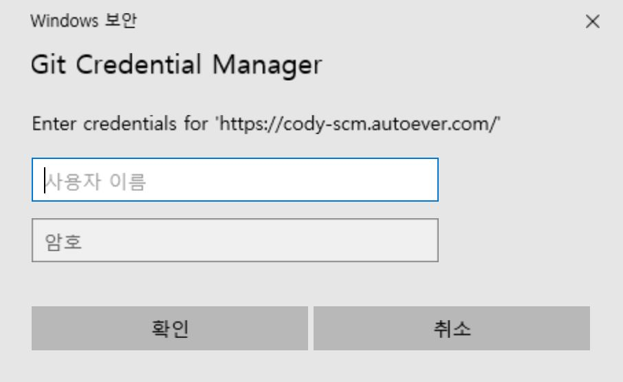

# GitLab에 코드베이스 Push 가이드

본 가이드에서는 GitLab 프로젝트를 생성하고 기존 CVS/SVN으로 버전관리하고 있는 코드베이스를 GitLab에 등록(Push)하는 방법을 설명합니다.

본 가이드에 따라 코드베이스를 GitLab에 Push하기 전에 [Git 설치 및 구성](01_Setup_Git.md) 문서를 참고하여 로컬 PC에 Git 사용 환경을 구성하여야 합니다.

## GitLab 프로젝트 생성

코드베이스를 업로드하기 위한 GitLab 프로젝트를 생성합니다.

웹 브라우저에서 GitLab에 접속한 후, 다음을 수행합니다.

* Projects 페이지 또는 특정 그룹에서 **New project** 버튼을 클릭합니다.
* **Create new project** 페이지에서 **Create blank project**를 클릭합니다.
* **Create blank project** 페이지에서 아래 항목을 입력 또는 선택하고 **Create project** 버튼을 클릭합니다.
  * **Project name** : 프로젝트 이름 입력 (예: `Migrating from SVN to GitLab`)
  * **Visibility Level** : `Private` 선택
  * **Initialize repository with a README** : **반드시 체크 해제**

> Project URL은 `https://<gitlab-domain>/<namespace>/<project-slug>` 형태입니다.  
> Namespace는 group, group/subgroup 또는 username이 될 수 있으며, 개인 프로젝트인 경우 username 입니다.

## GitLab에 Git Push

### gitignore 설정

GitLab으로 코드베이스를 Push하기 전에, Git 관리 대상에서 특정 파일 혹은 디렉토리를 제외하는 `.gitignore` 파일 설정이 필요합니다.  
로컬 환경에만 해당되는 설정이나 컴파일 결과 등 Git 리포지토리에 저장하여 관리할 필요가 없는 파일 및 디렉토리를 `.gitignore` 파일에 추가합니다.  
`.gitignore` 파일에 특정 파일 또는 폴더를 각각 추가하거나 [글로브 패턴(Glob pattern)](https://ko.wikipedia.org/wiki/%EA%B8%80%EB%A1%9C%EB%B8%8C_(%ED%94%84%EB%A1%9C%EA%B7%B8%EB%9E%98%EB%B0%8D))를 사용하여 추가하면 Git이 의도적으로 무시하도록 비추적(untracked) 파일로 지정됩니다.

코드베이스 루트 디렉토리에 아래 내용을 참고하여 `.gitignore` 파일을 생성합니다.  
(예: `/c/Users/Administrator/Workspace/migrating-from-svn-to-gitlab/.gitignore`)

```
### CVS ###
/CVS/*
**/CVS/*
.cvsignore
*/.cvsignore

### SVN ###
.svn/

### Maven
target/
!.mvn/wrapper/maven-wrapper.jar
!**/src/main/**/target/
!**/src/test/**/target/

### Gradle
.gradle
build/
!gradle/wrapper/gradle-wrapper.jar
!**/src/main/**/build/
!**/src/test/**/build/

### Eclipse ###
.metadata
bin/
tmp/
*.tmp
*.bak
*.swp
*~.nib
local.properties
.settings/
.loadpath
.recommenders

# External tool builders
.externalToolBuilders/

# Locally stored "Eclipse launch configurations"
*.launch

### STS ###
.apt_generated
.classpath
.factorypath
.project
.settings
.springBeans
.sts4-cache

### IntelliJ IDEA ###
.idea
*.iws
*.iml
*.ipr

### NetBeans ###
/nbproject/private/
/nbbuild/
/dist/
/nbdist/
/.nb-gradle/
build/
!**/src/main/**/build/
!**/src/test/**/build/

### VS Code ###
.vscode/
```

> [gitignore.io](https://www.toptal.com/developers/gitignore)을 이용하여 `.gitignore` 파일을 만들 수도 있습니다.

### Git Push

기존 형상관리시스템(CVS/SVN)에 사용자들이 더 이상 코드 커밋을 하지 않도록 조치 및 안내하고, 코드베이스를 최신 상태로 업데이트합니다.

이전 단계에서 생성한 GitLab 프로젝트 Overview 페이지(Project URL)의 **Push an existing folder** 섹션을 참고하여 다음을 수행하면 코드베이스를 GitLab에 Push 할 수 있습니다.

* `git init` 명령을 실행하여 Git 로컬 저장소를 생성(초기화)합니다.

  ```bash
  cd existing_folder # 코드베이스 루트 디렉토리로 이동
  git init
  ```

* Git 원격 저장소(GitLab) 정보를 추가합니다.

  ```bash
  git remote add origin git@gitlab.example.com:my-group/migrating-from-svn-to-gitlab.git
  ```

* `git status` 명령을 실행하여 Git 현재 상태를 확인합니다.

  ```bash
  $ git status
  On branch master
  Your branch is up to date with 'origin/master'.
  
  Untracked files:
  (use "git add <file>..." to include in what will be committed)
    .gitignore
    .mvn/
    mvnw
    mvnw.cmd
    pom.xml
    src/
  
  nothing added to commit but untracked files present (use "git add" to track)
  ```

  > Git 리포지토리의 상태는 Untracted, Unmodified, Modified, Staged가 있는데, 현재 Untracted 상태임을 알 수 있습니다.

* `git add` 명령을 실행합니다.

  ```bash
  git add .
  ```

* 다시 `git status` 명령을 실행하여 Git 상태를 확인합니다.

  ```bash
  $ git status
  On branch master
  Your branch is up to date with 'origin/master'.
  
  Changes to be committed:
  (use "git restore --staged <file>..." to unstage)
    new file:   .gitignore
    new file:   .mvn/wrapper/MavenWrapperDownloader.java
    new file:   .mvn/wrapper/maven-wrapper.jar
    new file:   .mvn/wrapper/maven-wrapper.properties
    new file:   mvnw
    new file:   mvnw.cmd
    new file:   pom.xml
    new file:   src/main/java/io/infograb/hello/HelloWorldApplication.java
    new file:   src/main/resources/application.properties
    new file:   src/test/java/io/infograb/hello/HelloWorldApplicationTests.java
    ...
  ```

  > Git 상태 확인 결과, 추가된 파일 목록 중 Git 관리 대상에서 제외할 파일 혹은 디렉토리가 있으면 `.gitignore` 파일의 내용을 수정하여 설정합니다.

* `git commit` 명령을 실행하여 로컬 리포지토리에 기록합니다. `-m` 옵션을 사용하여 커밋 메시지를 인라인으로 추가합니다.

  ```bash
  git commit -m "Migrating from SVN"
  ```

* `git status` 명령을 실행하여 Git 상태를 확인합니다.
* `git push` 명령을 실행하여 원격 저장소인 GitLab으로 Push 합니다.

  ```bash
  git push -u origin master
  ```

  > `git branch` 명령을 실행하여 현재 브랜치가 `master`가 아니면, `git branch -m master` 명령을 실행하여 `master` 브랜치로 변경합니다. Git 설치 시 옵션에 따라 로컬 저장소의 기본 브랜치가 `main`일 수 있습니다.

  > **HTTPS** 프로토콜을 사용하여 처음으로 GitLab에 Push하는 경우, 아래 이미지와 같이 Git Credential Manager 창이 나타납니다. GitLab 계정과 패스워드를 입력하고 **확인** 버튼을 클릭합니다.

  

* GitLab 프로젝트의 Repository에 코드베이스가 업로드된 것을 확인할 수 있습니다.
