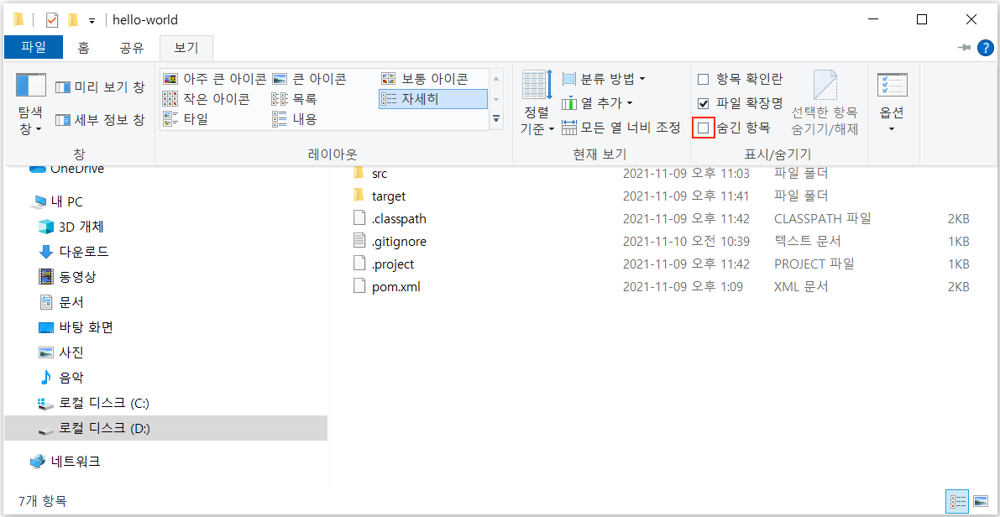

# Sourcetree로 GitLab에 코드베이스 Push 하기

본 가이드에서는 Git 명령어에 익숙하지 않아 Git을 사용하는데 어려움이 있는 사용자를 위해, Git CLI(Command Line Interface)를 사용하는 대신 Git GUI 클라이언트인 **Sourcetree**을 이용하여 GitLab에 소스코드를 올리는(Push) 방법을 설명합니다.

## GitLab 프로젝트 생성

기존에 CVS 또는 SVN으로 버전관리하고 있던 프로젝트의 코드베이스를 업로드하기 위한 GitLab 프로젝트를 생성합니다.

웹 브라우저에서 GitLab에 접속한 후, 다음을 수행합니다.

* Projects 페이지 또는 특정 그룹에서 **New project** 버튼을 클릭합니다. (예제에서는 `Tutorials` 그룹에서 프로젝트 생성)
* **Create new project** 페이지에서 **Create blank project**를 클릭합니다.
* **Create blank project** 페이지에서 아래 항목을 입력 또는 선택하고 **Create project** 버튼을 클릭합니다.
  * **Project name** : 원하는 프로젝트 이름 입력 (예: `Hello World`)
  * **Visibility Level** : `Private` 선택
  * **Initialize repository with a README** : **반드시 체크 해제**

  

* 프로젝트가 생성되면 아래 이미지와 같이 **Project overview** 페이지로 이동됩니다.

  

## Sourcetree 설치

**Sourcetree**는 Jira, Confluence와 같은 솔루션으로 유명한 [Atlassian(아틀라시안)](https://www.atlassian.com/ko)에서 제작한 무료 Git GUI 클라이언트입니다.

다음과 같이 수행하여 Sourcetree를 설치합니다.

* [Sourcetree](https://www.sourcetreeapp.com/) 웹사이트에서 **Download for Windows** 버튼을 클릭한 후, Atlassian 소프트웨어 라이선스 계약 및 개인정보 보호정책에 동의하고 설치파일을 다운로드 받습니다.
* 다운로드 받은 설치파일을 실행하여 설치를 진행합니다.
* [Bitbucket](https://www.atlassian.com/ko/software/bitbucket) 대신 GitLab을 사용할 것이므로, **건너뛰기** 버튼을 클릭합니다.

  

* 이미 Git을 설치한 경우, 아래 이미지와 같이 Git 설치 정보가 나타납니다. 아직 설치하지 않은 경우에는 체크박스가 보이며, 체크하고 Git을 설치할 수 있습니다. Mercurial을 설치하지 않을 것이기 때문에 **체크를 해제**하고 **다음** 버튼을 클릭합니다.

  

* **이름**과 **이메일**을 입력하고 **다음** 버튼을 클릭합니다.

  

* **아니오** 버튼을 클릭하고 설치를 완료합니다.

  

## Git 저장소 추가

**Sourcetree**을 사용하여 Git 명령을 수행하기 위해서는 Sourcetree에 프로젝트의 코드베이스 폴더를 **로컬 저장소**로 등록하고 **원격 저장소**인 GitLab 프로젝트의 Repository를 연결해야 합니다.

* Sourcetree 설치가 완료되면 아래와 같은 화면이 나타납니다. **Add**를 클릭합니다.

  

* **탐색** 버튼을 클릭한 후, **작업 경로**(코드베이스 폴더)를 선택합니다. 작업 경로를 선택하면 이름 필드는 자동으로 채워집니다. **추가** 버튼을 클릭합니다.

  

* 아래와 같이 Workspace 파일 상태 창이 열립니다. **설정** 버튼을 클릭합니다.

  

* **원격** 탭에서 **추가** 버튼을 클릭합니다.

  

* **원격 이름** 필드에 `origin`을 입력하고 **URL/경로** 필드에 "GitLab 프로젝트의 Repository URL"을 입력한 후, **확인** 버튼을 클릭합니다.

  > GitLab의 Project overview 페이지에서 **Clone** 버튼을 클릭한 후, **Copy URL** 아이콘을 클릭하면 Repository URL을 복사할 수 있습니다.

  

* 목록에 원격 저장소 정보가 추가된 것을 확인할 수 있습니다. **확인** 버튼을 클릭합니다.

  

## `.gitignore` 설정

Sourcetree의 Workspace 파일 상태 창에서 **스테이지에 올라가지 않은 파일 (Unstaged Files)** 목록 중 `.classpath`, `.project` 및 `.settings/`와 같이 IDE에서 자동으로 생성되거나 로컬 환경에만 해당되는 설정 파일 및 디렉토리를 볼 수 있습니다. 또한, `.git`, `.svn`와 같은 로컬 저장소(버전관리 시스템)가 사용하는 파일 및 디렉토리가 있는데, 이런 파일 및 디렉토리는 버전 관리할 필요가 없습니다.

로컬 환경에만 해당되는 설정이나 컴파일 결과 등 Git 리포지토리에 저장하여 관리할 필요가 없는 파일 및 디렉토리를 `.gitignore` 파일에 추가하면 Git이 의도적으로 무시하도록 비추적(untracked) 파일로 지정할 수 있습니다.  
`.gitignore` 파일에 특정 파일 또는 폴더를 각각 추가하거나 [글로브 패턴(Glob pattern)](https://ko.wikipedia.org/wiki/%EA%B8%80%EB%A1%9C%EB%B8%8C_(%ED%94%84%EB%A1%9C%EA%B7%B8%EB%9E%98%EB%B0%8D))를 사용하여 지정할 수 있습니다.

다음과 같이 `.gitignore`를 설정합니다.

* Sourcetree에서 **설정** 버튼을 클릭한 후, **고급** 탭을 클릭합니다.

  

* **편집** 버튼을 클릭한 후, 메모장을 선택합니다.

  

* 아래 내용을 참고하여 `.gitignore` 파일을 편집하고 저장한 후, 메모장을 닫습니다.

  > [gitignore.io](https://www.toptal.com/developers/gitignore)을 이용하여 `.gitignore` 파일을 만들 수도 있습니다.

  

  ```gitignore
  ### CVS ###
  /CVS/*
  **/CVS/*
  .cvsignore
  */.cvsignore

  ### SVN ###
  .svn/

  ### Maven
  target/
  !.mvn/wrapper/maven-wrapper.jar
  !**/src/main/**/target/
  !**/src/test/**/target/

  ### Gradle
  .gradle
  build/
  !gradle/wrapper/gradle-wrapper.jar
  !**/src/main/**/build/
  !**/src/test/**/build/

  ### Eclipse ###
  .metadata
  bin/
  tmp/
  *.tmp
  *.bak
  *.swp
  *~.nib
  local.properties
  .settings/
  .loadpath
  .recommenders

  # External tool builders
  .externalToolBuilders/

  # Locally stored "Eclipse launch configurations"
  *.launch

  ### STS ###
  .apt_generated
  .classpath
  .factorypath
  .project
  .settings
  .springBeans
  .sts4-cache

  ### IntelliJ IDEA ###
  .idea
  *.iws
  *.iml
  *.ipr

  ### NetBeans ###
  /nbproject/private/
  /nbbuild/
  /dist/
  /nbdist/
  /.nb-gradle/
  build/
  !**/src/main/**/build/
  !**/src/test/**/build/

  ### VS Code ###
  .vscode/
  ```

* 고급 탭에서 **확인** 버튼을 클릭하여 "저장소 설정" 창을 닫습니다.  
  **스테이지에 올라가지 않은 파일** 목록에서 `.gitignore`에 추가한 파일들이 제외된 것을 확인할 수 있습니다.

## GitLab에 코드베이스 올리기

다음과 같이 수행하면 Git Bash 또는 명령 프롬프트(CMD)에서 Git CLI를 사용하여 Git 명령을 실행하는 것과 동일하게, GUI 환경에서 소스코드를 로컬 저장소에 커밋(Commit)하고 원격 저장소(GitLab)에 푸시(Push)할 수 있습니다.

* **모두 스테이지에 올리기** 버튼을 클릭합니다. 이렇게 하는 것은 `git add .` 명령을 실행한 것과 동일합니다.

  > 특정 파일을 선택하고 **선택 내용 스테이지에 올리기** 버튼을 클릭하여 원하는 파일만 스테이지에 올릴 수 있습니다. 예를들어, `pom.xml` 파일을 선택하고 이 버튼을 클릭하면 `git add pom.xml` 명령을 실행하는 것과 같이 `pom.xml` 파일만 스테이지에 올라갑니다.

  

* **스테이지에 올라간 파일** 목록에 파일들이 추가된 것을 확인할 수 있습니다.

  > 제외 시킬 파일이 있으면 파일을 선택하고 **선택 내용 스테이지에서 내리기** 버튼을 클릭하면 "스테이지에 올라가지 않은 파일" 목록으로 내려갑니다.

  

* 커밋 메시지를 입력하고 **커밋** 버튼을 클릭합니다. 이것은 `git commit -m "Migrating from SVN"` 명령을 실행한 것과 동일합니다.

  > **Git 커밋**이란 스테이지에 올라간 파일(Staged Files, 추가/변경 사항)을 로컬 저장소에 기록하는 것을 말합니다.

  

* **Push** 버튼을 클릭합니다.

  > **Git Push**는 로컬 저장소에 커밋한 변경 이력을 원격 저장소에 반영하는 것을 의미합니다.

  

* **리모트 브랜치**에 `master`를 입력합니다.

  

* 체크박스를 선택하고 **Push** 버튼을 클릭합니다.

  

* 처음으로 Git Push를 하는 경우, **Git Credential Manager** 창이 나타납니다. GitLab의 계정(username)과 패스워드를 입력하고 **확인** 버튼을 클릭합니다.

  

* Sourcetree에서 Git Push가 완료된 후, GitLab의 **Project overview** 페이지를 새로고침하면 아래 이미지와 같이 코드베이스가 올라간 것을 확인할 수 있습니다.

  

* Sourcetree의 **Workspace > History** 메뉴에서 Commit/Push 이력을 확인할 수 있습니다.

  

## 원격 아이콘의 빨간색 느낌표 제거

원격 아이콘에 빨간색 느낌표가 있는데, 원격 아이콘을 클릭하면 원격 저장소로 설정한 GitLab 프로젝트의 Repository가 정상적으로 웹브라우저에서 열립니다. **사용하는 데에는 문제가 없으나, 오류가 발생한 것처럼 보여 거슬립니다.**

> 이는 Windows용 Sourcetree의 추가 확장 통합(Optional extended integration) 관련 버그 입니다. Atlassian Community에 아래 링크와 같은 관련 문의사항이 있습니다.
> 
> [Sourcetree is showing a red exclamation mark next to 'Remote' button since updating to version 3.0.6](https://community.atlassian.com/t5/Sourcetree-questions/Sourcetree-is-showing-a-red-exclamation-mark-next-to-Remote/qaq-p/909571)
> [Red Exclamation Mark on Remote Icon](https://community.atlassian.com/t5/Sourcetree-questions/Red-Exclamation-Mark-on-Remote-Icon/qaq-p/1174179)

다음과 같이 수행하면 **원격 아이콘의 빨간색 느낌표가 제거됩니다.**

1. Sourcetree를 종료합니다.
2. 파일 탐색기에서 코드베이스 경로(로컬 저장소)의 `.git` 디렉토리로 이동합니다.
3. `sourcetreeconfig.json` 파일을 메모장이나 기타 텍스트 편집기로 열고, 아래 내용으로 수정한 후 저장합니다.

   수정 전 :

   ```json
   "RemoteProjectLinks": []
   ```

   수정 후 :

   ```json
   "RemoteProjectLinks": [{"Type":0}]
   ```

4. Sourcetree를 다시 실행하면 원격 아이콘에서 빨간색 느낌표가 제거된 것을 확인할 수 있습니다.

    

> 파일 탐색기에서 `.git` 디렉토리를 볼 수 없는 경우, 아래와 같이 수행하면 됩니다.
> * 파일 탐색기의 **보기**를 클릭합니다.
>   
> * **숨김 항목**을 체크합니다.
>   
> * 아래 이미지와 같이 숨김 폴더가 보입니다.
>   
> * `.git` 폴더로 이동하면 `sourcetreeconfig.json` 파일을 볼 수 있습니다.
>   
