# Postman으로 GitLab REST API 사용하기

본 가이드에서는 Postman을 설치하고 사전에 작성된 GitLab REST API의 컬렉션(Collections) 및 환경(Environments) 파일을 Postman에 Import(가져오기)한 후, Postman으로 GitLab REST API를 테스트하는 방법을 설명합니다.

## Postman 설치

**Postman**은 API를 작성하고 사용하기 위한 API 플랫폼입니다. Postman은 API 수명 주기의 각 단계를 단순화하고 협업을 간소화하여 더 나은 API를 더 빠르게 만들 수 있습니다.

* [Download](https://www.postman.com/downloads/) 페이지에서 설치 파일을 다운로드 받은 후 실행하여 설치합니다.
* **Skip and go to the app** 링크를 클릭하여 Postman Overview 화면으로 이동합니다. (계정을 생성하거나 로그인 한 후 사용할 수 있습니다.)

  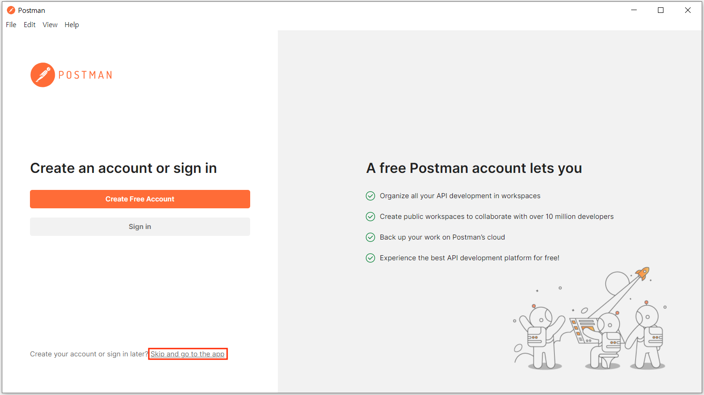

## Postman에 Collections 및 Environments 가져오기

다른 사람이 이미 작성한 Collections(API Request 모음)과 Environments을 Import하여 사용할 수 있습니다.

아래와 같이 실행하여 사전에 작성한 GitLab REST API의 Collections 및 Environments을 Import합니다.

* **Import** 버튼을 클릭합니다.

  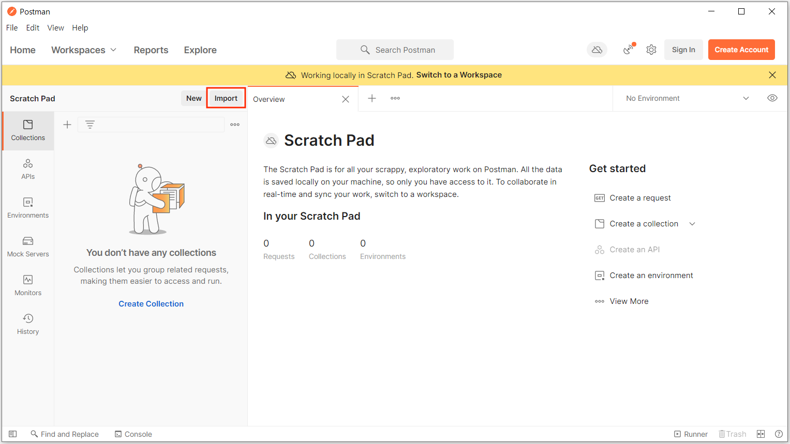

* **Upload Files** 버튼을 클릭한 후, Collections 및 Environments 파일을 선택합니다.

  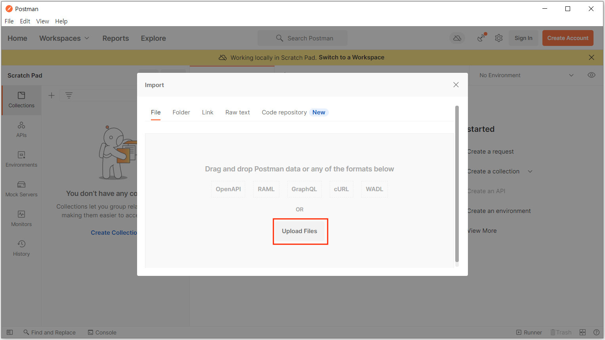

* **Import** 버튼을 클릭합니다.

  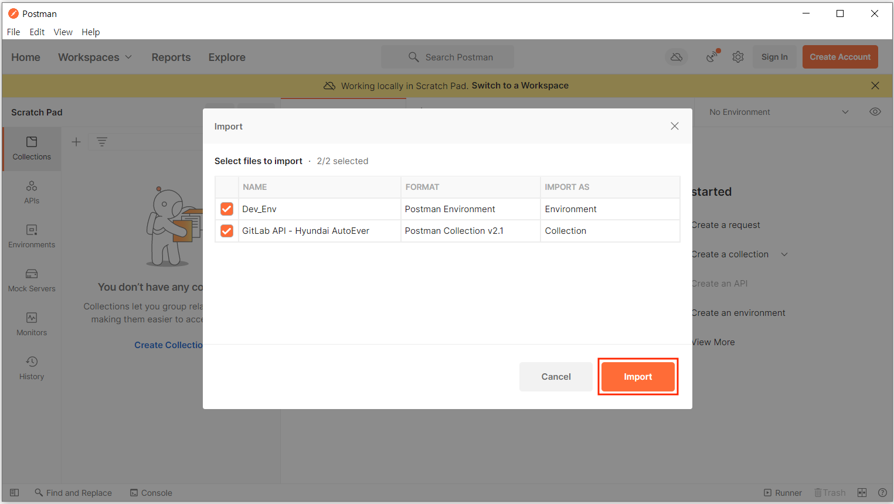

* Import가 완료되면 아래와 같이 왼쪽 패널에 "GitLab API - Hyundai AutoEver"라는 Collection이 생성된 것을 확인할 수 있습니다.

  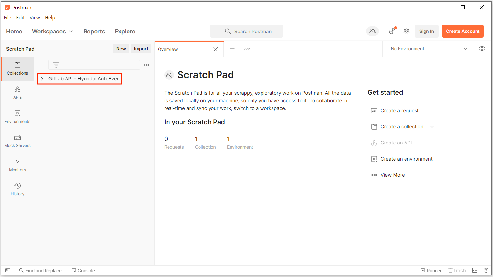

## GitLab 액세스 토큰 생성

GitLab API를 사용하려면 GitLab의 Personal Access Token이 필요합니다.  
해당 프로젝트에 권한이 있는 사용자의 액세스 토큰을 사용하여야 API으로 프로젝트 정보, 이슈, Merge request, CI/CD 파이프라인 등 GitLab의 리소스에 액세스할 수 있습니다.

GitLab API에 사용할 엑세스 토큰을 생성합니다.

* GitLab에서 우측 상단에 있는 아바타를 클릭하고 **Edit profile**을 선택합니다.
* **User Settings** 페이지의 좌측 사이드 바에서 **Access Tokens**를 클릭합니다.
* **Token name** 필드에 토큰의 이름을 입력합니다. (예: `gitlab-token`)
* **Expiration date** 필드에 만료 날짜를 선택합니다. (선택사항)
* **Scopes**에서 `api` 체크박스를 체크하고 **Create personal access token** 버튼을 클릭합니다.

  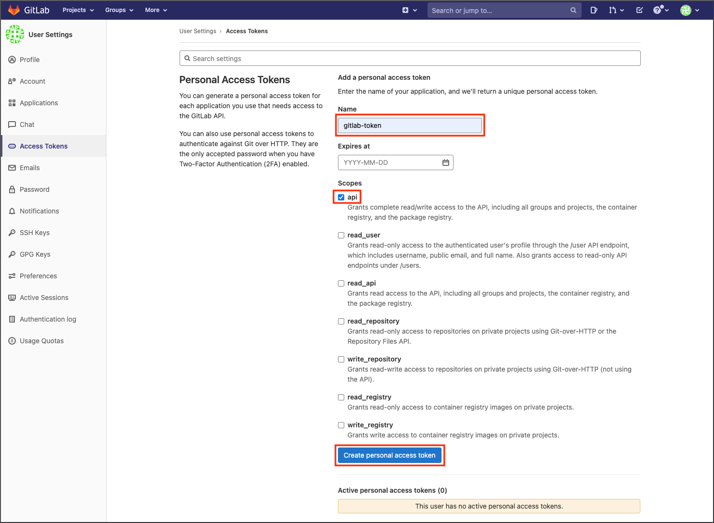

* **Your new personal access token** 필드에 생성된 액세스 토큰이 표시됩니다.
* **Copy personal access token** 아이콘을 클릭하여 복사하고, **액세스 토큰을 기록해 둡니다.**

  > **페이지를 나가거나 새로 고침하면 다시 액세스 할 수 없습니다.**

  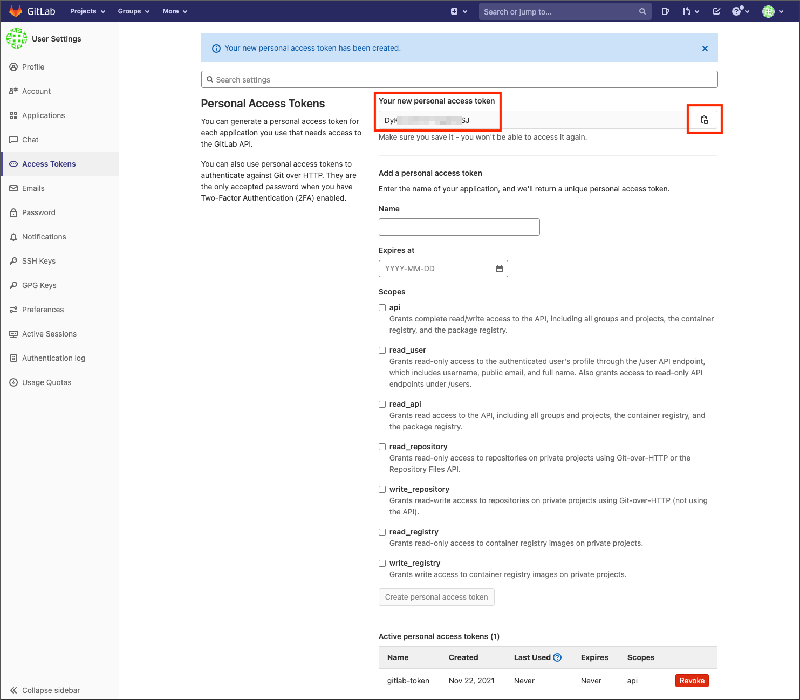

## Postman 환경(Environments) 설정

Postman에서 **Environments**은 환경 별로 달라지는 변수들을 관리하기 위한 기능입니다.  
환경에 변수를 추가한 후, API 요청(Request)의 URL 및 파라미터에서 `{{your_variable}}` 형태로 사용하여 요청을 전송하면 해당 변수의 값으로 치환됩니다.

테스트하려는 GitLab 프로젝트에 맞게 환경의 변수 값을 수정합니다.

* 왼쪽 패널에서 **Environments > Dev_Env**를 클릭하면 Import한 `Dev_Env` 환경을 볼 수 있습니다.

  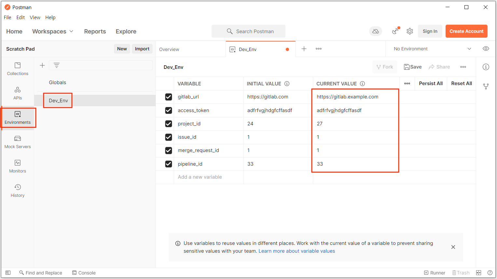

* 컬렉션이나 환경을 공유하면 초기 값(Initial value)이 공유됩니다. 현재 값(Current value)은 로컬이며 동기화되거나 공유되지 않습니다. 로컬 변수와 동기화 변수에 대한 자세한 내용은 [데이터 공유 및 유지](https://learning.postman.com/docs/sending-requests/variables/#sharing-and-persisting-data)를 참조하세요.
* 테스트하려는 환경에 맞게 변수들의 현재 값(Current value)을 수정합니다.
  * gitlab_url : API로 접속하려는 GitLab의 URL
  * access_token : 이전 단계에서 생성한 Personal Access Token
  * project_id : 테스트하려는 GitLab의 프로젝트 ID (GitLab의 Project overview > Details 페이지에서 Project ID 확인)
  * issue_id : 이슈 생성 후, "이슈 상세 정보", "이슈 수정" 등의 요청에서 사용할 이슈의 ID
  * merge_request_id : MR(Merge request) 생성 후, "MR 정보 가져오기", "MR 병합(Merge)" 등의 요청에서 사용할 MR의 ID
  * pipeline_id : "Pipeline 정보 가져오기" 요청에서 사용할 Pipeline의 ID
* 오른쪽 상단에 있는 **No Environment**로 되어 있는 콤보박스를 클릭한 후 방금 설정한 `Dev_Env`를 선택합니다.

## GitLab REST API 인증 방식

GitLab REST API 요청 시 액세스 토큰을 사용하여 인증하게 되는데, 다음과 같이 두 가지 방식이 있습니다.

**매개변수(Parameter)에서 액세스 토큰을 사용하는 방식 :**

  ```bash
  curl "https://gitlab.example.com/api/v4/projects?private_token=<your_access_token>"
  ```

  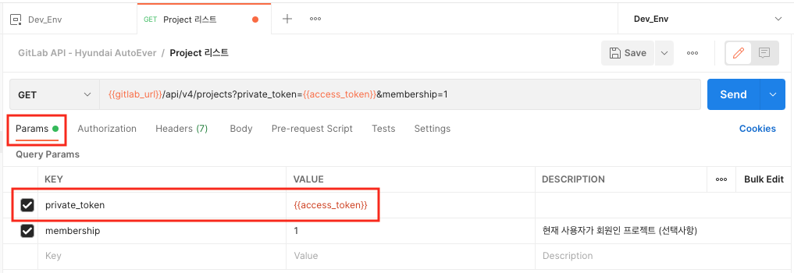

**헤더(Header)에서 액세스 토큰을 사용하는 방식 :**

  ```bash
  curl --header "PRIVATE-TOKEN: <your_access_token>" "https://gitlab.example.com/api/v4/projects"
  ```

  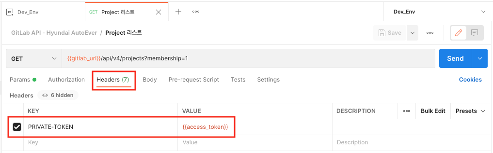

## GitLab REST API 사용

Postman에 필요한 구성을 완료하였으므로, 이제 Postman으로 GitLab REST API 요청을 전송할 수 있습니다.

"GitLab API - Hyundai AutoEver" Collection의 아이콘을 클릭하면, 하위에 API 요청(Request) 목록이 보입니다.  
각 요청(Request)을 클릭하면 해당 API의 URL 및 Query Params이 오른쪽 패널에 나타납니다.

Query Params의 각 파라미터 왼쪽에 있는 콤보박스를 체크하거나 해제하여 파라미터를 추가하거나 제거할 수 있습니다.  
필수(Required) 파라미터를 제외하고 요청을 전송하면 오류가 발생합니다.

  

**Send** 버튼을 클릭하여 GitLab API 요청을 전송하면 아래와 같이 응답으로 JSON 데이터를 얻을 수 있습니다.

  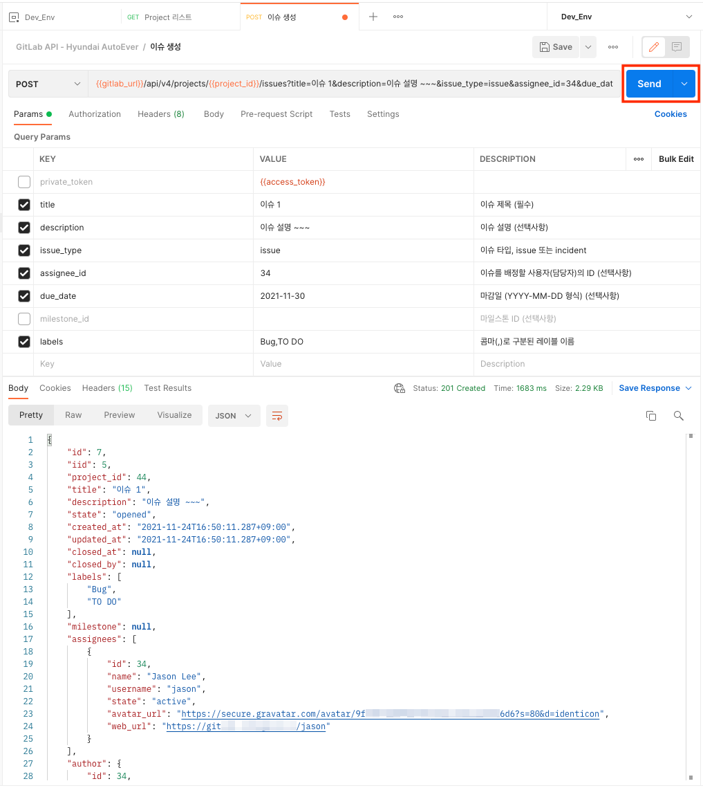

Environments에서 `issue_id`의 현재 값을 위의 응답 `iid`의 값으로 수정한 후, Collections에서 "이슈 상세 정보" 요청을 클릭합니다.  
**Send** 버튼을 클릭하면 이슈의 상세 정보를 JSON 데이터로 얻을 수 있습니다.

  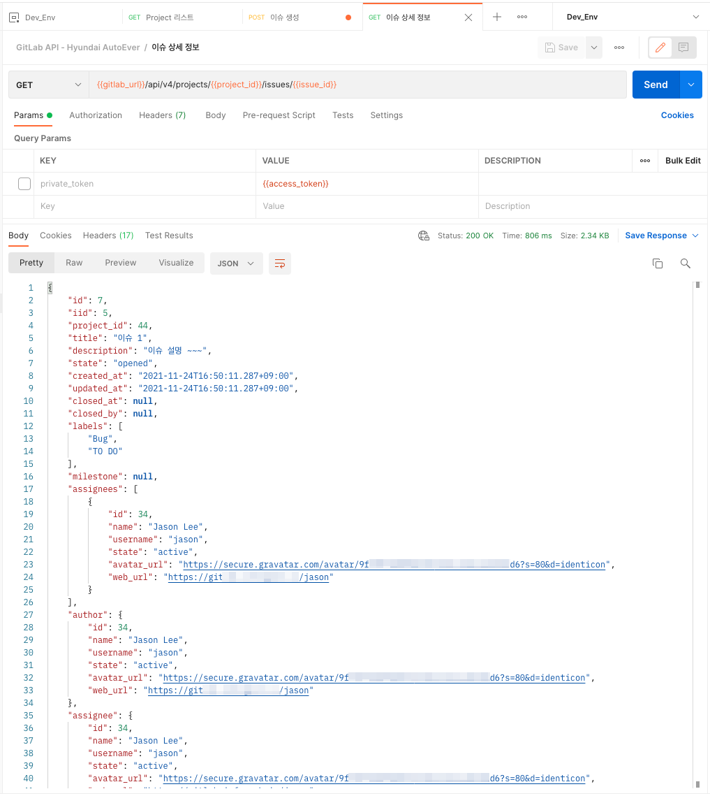

GitLab REST API에 대한 자세한 내용은 [REST API resources](https://docs.gitlab.com/ee/api/api_resources.html), [Projects API](https://docs.gitlab.com/ee/api/projects.html), [Issues API](https://docs.gitlab.com/ee/api/issues.html), [Merge requests API](https://docs.gitlab.com/ee/api/merge_requests.html), [Pipelines API](https://docs.gitlab.com/ee/api/pipelines.html) 문서를 참조하세요.
