# GitLab과 함께 Sourcetree 사용법

본 가이드에서는 **Sourcetree**를 사용하여 **GitLab**에 있는 저장소(Repository)를 **Clone**한 후, 소스 코드를 수정하고 **Commit/Push** 하는 방법을 설명합니다.

우선 [Sourcetree로 GitLab에 코드베이스 Push 하기](03_Push_Codebase_to_GitLab_with_Sourcetree.md) 가이드에 따라 코드베이스가 **GitLab 프로젝트의 Repository에 등록**되어 있어야 하며, **Sourcetree 설치**도 되어 있어야 합니다.

## GitLab 브랜치 생성 및 설정

개발자가 `git clone` 한 후, 개발을 진행하고 변경사항을 Commit/Push할 개발 전용 브랜치를 생성합니다. 개발자는 `develop` 브랜치에만 Push 또는 Merge 할 수 있도록 하고, `master` 브랜치에는 변경사항이 Merge request(MR)을 통해서만 반영되도록 Protected 브랜치 설정을 합니다.

> **Maintainer** 또는 **Owner** 권한이 있어야 합니다.

### `develop` 브랜치 생성

개발을 진행하고 개발 서버에 배포되는 `develop` 브랜치를 생성를 생성합니다.

* GitLab 프로젝트의 사이드 바에서 **Repository > Branches**를 선택합니다.
* **New branch** 버튼을 클릭합니다.

  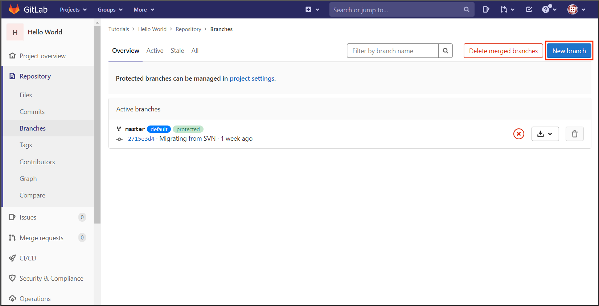

* **New branch** 페이지에서 **Branch name** 필드에 `develop`을 입력하고 **Create branch** 버튼을 클릭합니다.

  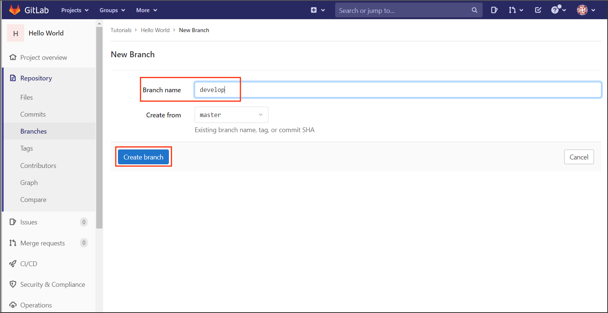

### Protected 브랜치 설정

실수로 브랜치가 삭제되는 것을 방지하고, 브랜치별 Merge 및 Push에 대한 허용 권한을 설정합니다.

* 사이드 바에서 **Settings > Repository**를 선택합니다.
* **Protected branches** 섹션을 확장합니다.
* 아래 항목을 선택하고 **Protect** 버튼을 클릭합니다.
  * **Branch** : `develop` 브랜치 선택
  * **Allowed to merge** : `Maintainer + Developer` 선택
  * **Allowed to push** : `Maintainer + Developer` 선택

  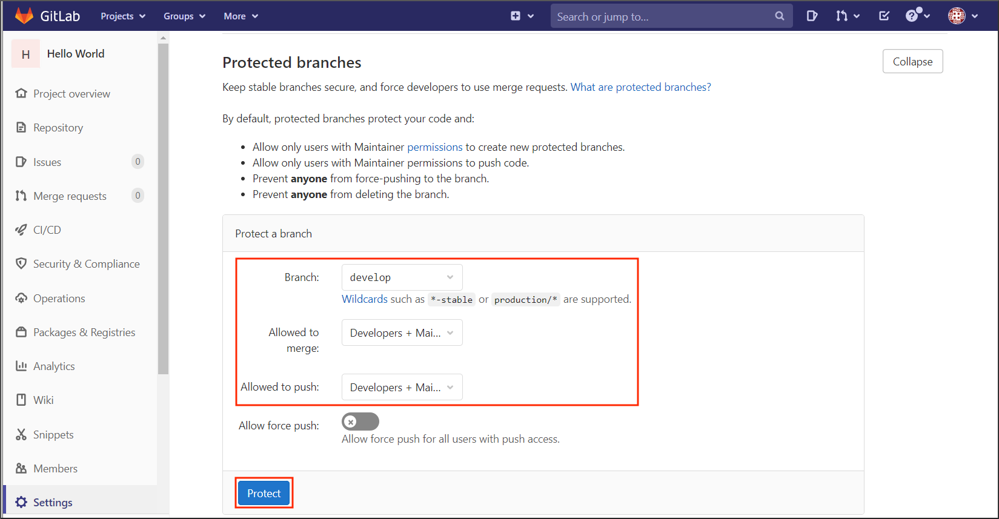

* `master` 브랜치의 **Allowed to push**를 `No one`으로 변경합니다. 이렇게 하면, 아무도 직접 Push하지 못하게 하여 Merge request를 통해서만 `master` 브랜치에 변경사항이 반영되도록 설정됩니다.

  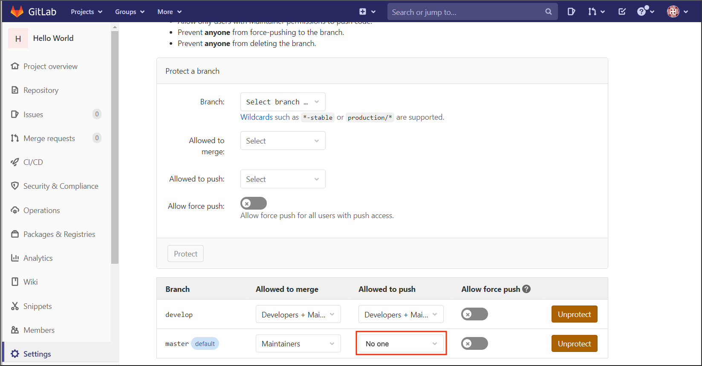

## 저장소 Clone

로컬 PC에서 개발을 진행하기 위해 Git 원격 저장소인 **GitLab**의 저장소(Repository)를 **Clone** 합니다.

* GitLab의 Project overview 페이지 또는 Repository 페이지에서 **Clone** 버튼을 클릭한 후, **Copy URL** 아이콘을 클릭하여 Repository URL을 복사합니다.

  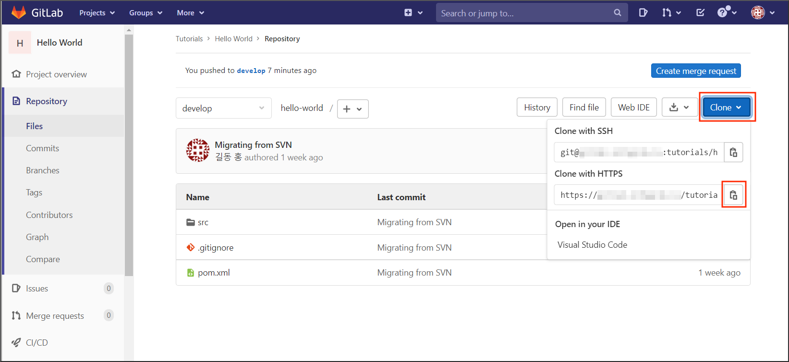

* Sourcetree에서 **Clone**을 클릭합니다.

  > 이미 등록한 저장소가 있으면 **+** 아이콘을 클릭하여 새 탭을 열고 **Clone**을 클릭합니다.

  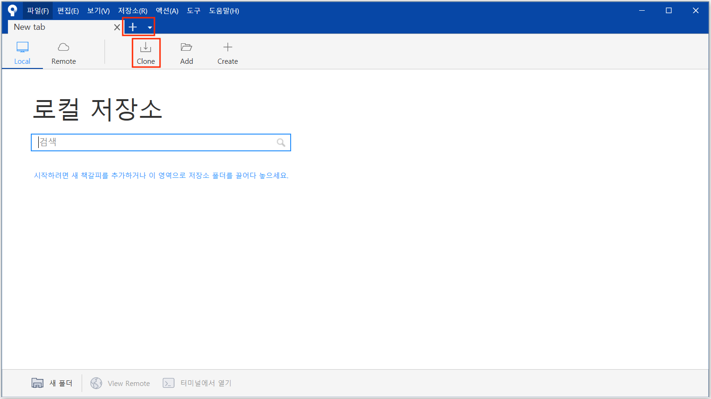

* 복사한 Repository URL을 붙여놓은 후, **탐색** 버튼을 클릭하여 로컬에서 작업할 디렉토리를 선택하고 **클론** 버튼을 클릭합니다.

  > 저장소 이름은 자동으로 지정되는데, 필요하면 수정합니다.

  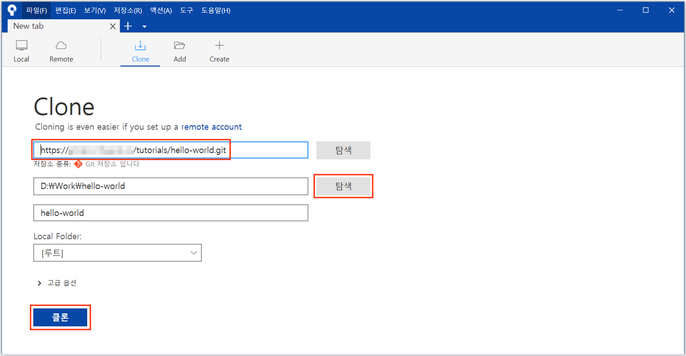

* 처음으로 Clone하는 경우 **Git Credential Manager** 창이 나타나는데, GitLab 계정과 패스워드를 입력하고 **확인** 버튼을 클릭합니다.

  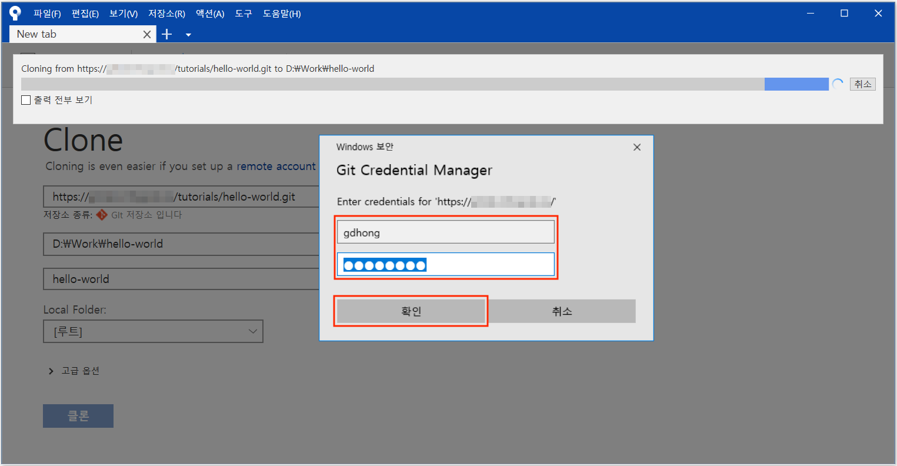

* Clone이 완료되면 아래와 같은 화면이 나타납니다. **원격 > origin**을 확장하고 `develop`을 선택하고 마우스 우클릭한 후, **Checkout**을 선택합니다.

  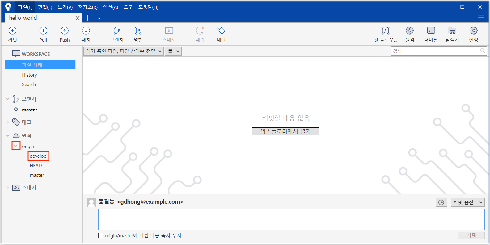

* **체크아웃할 원격 브랜치**와 **새 로컬 브랜치명**을 확인하고, **확인** 버튼을 클릭합니다.

  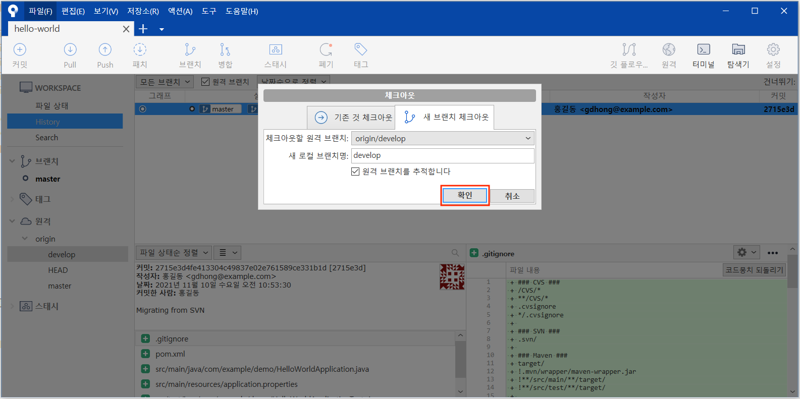

* Checkout이 완료되면 왼쪽 사이드바의 브랜치에 **develop**이 생긴 것을 확인할 수 있습니다.

  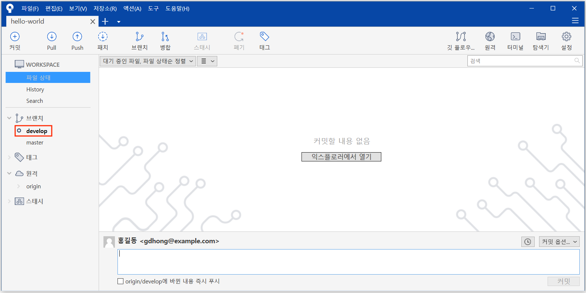

## 소스 코드 수정 및 Commit/Push

Eclipse에서 Clone 받은 로컬 저정소를 프로젝트로 구성하여 개발을 진행한 후, 변경사항을 로컬 `develop` 브랜치에 **Commit**하고 GitLab의 `develop` 브랜치에 **Push** 합니다.

* Eclipse에서 소스 코드를 수정합니다.

  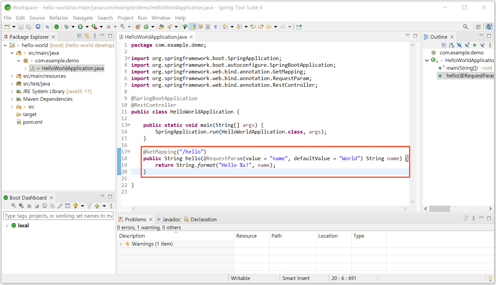

* Sourcetree의 파일 상태에서 변경된 내용을 확인할 수 있습니다. **모두 스테이지에 올리기** 또는 **선택 내용 스테이지에 올리기** 버튼을 클릭하여 스테이지에 올립니다.

  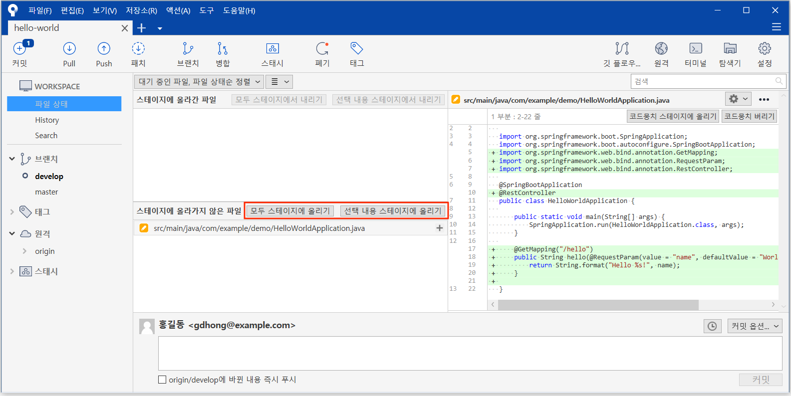

* 커밋 메시지를 입력하고 **커밋** 버튼을 클릭합니다.

  > 커밋 메시지에 `#xxx`와 같이 관련 이슈 번호를 추가하면 GitLab UI의 커밋 내역에 이슈에 대한 [크로스링크](https://docs.gitlab.com/ee/user/project/issues/crosslinking_issues.html)가 생성됩니다.

  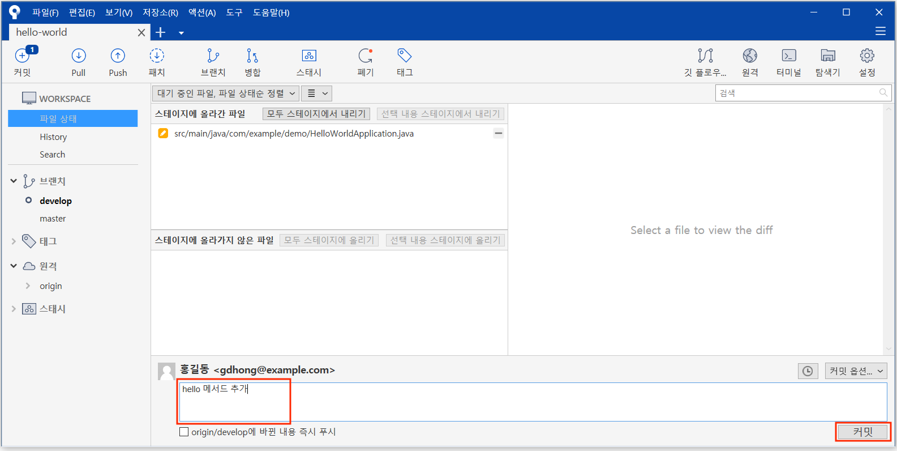

* **History**에 커밋 이력이 추가된 것을 확인할 수 있습니다. **Push** 버튼을 클릭합니다.

  > Push을 하기 전에, **Pull**을 클릭하여 Pull을 먼저 하는 것이 좋습니다. Conflict(충돌)이 있는 경우 Push 시 에러가 발생합니다.

  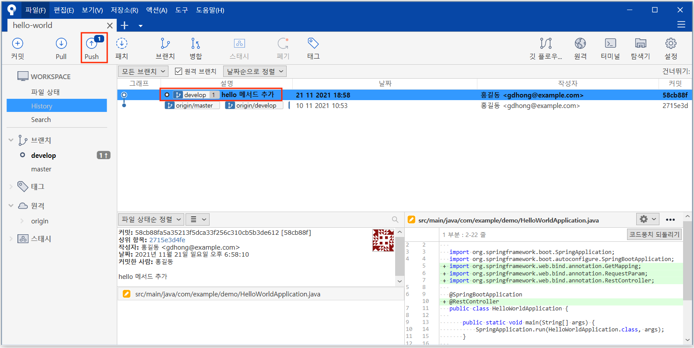

* 로컬 `develop` 브랜치를 체크하고 **Push** 버튼을 클릭합니다.

  > GitLab의 `develop` 브랜치에 변경사항이 Push 되면, 개발서버에 반영되도록 CI 파이프라인을 구성하여 실행할 수 있습니다.

  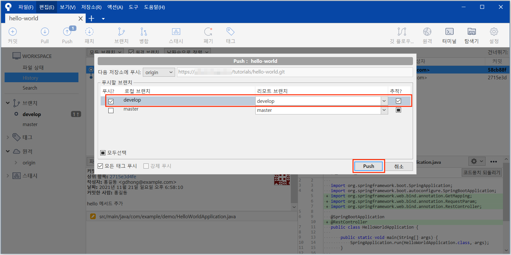

* **History**에서 `origin/develop`에 Push된 것을 확인할 수 있습니다.

  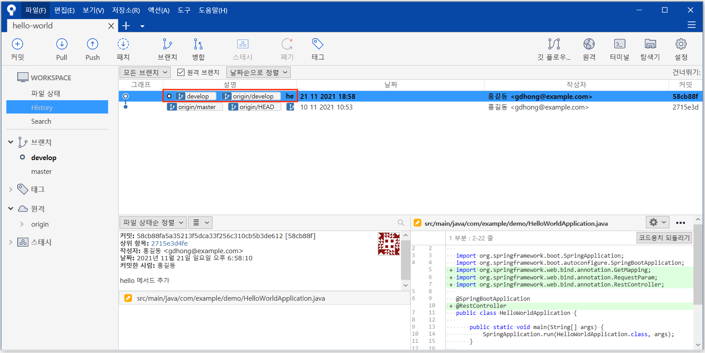

* GitLab 프로젝트의 **Repository > Commits** 페이지에서 커밋 내용을 확인할 수 있습니다.

  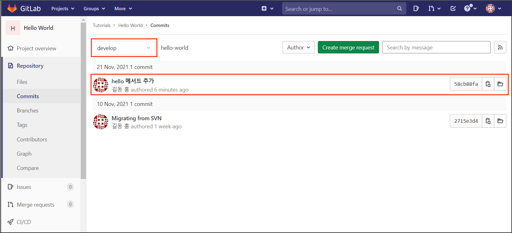

## Merge Request

개발이 완료되어 `develop` 브랜치에 Push한 변경사항을 `master` 브랜치에 반영하기 위해서는 개발자가 Merge Request(MR)을 생성한 후, 권한 있는 사용자(Maintainer 또는 Owner)가 승인(Approve) 및 병합(Merge) 합니다.

* GitLab 프로젝트의 사이드 바에서 **Merge requests**를 선택한 후, **Create merge request** 버튼을 클릭합니다.

  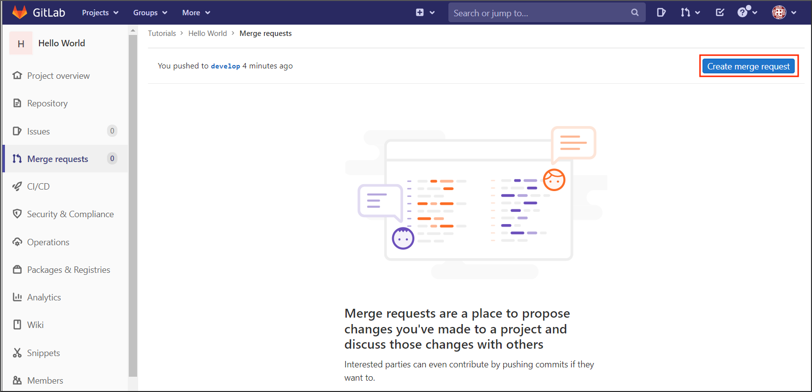

* Title, Description을 입력합니다.

  > 기본적으로 Title 필드에 마지막 커밋 메지시가 자동 채워집니다.

  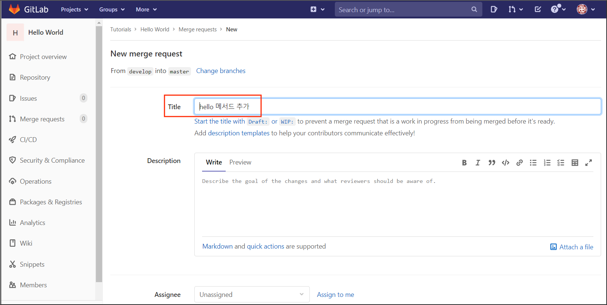

* 기타 선택(Optional) 필드을 선택하고 **Create merge request** 버튼을 클릭합니다.

  > **Commits** 탭과 **Changes** 탭을 클릭하여 Merge할 커밋 이력과 변경 내용을 확인할 수 있습니다.

  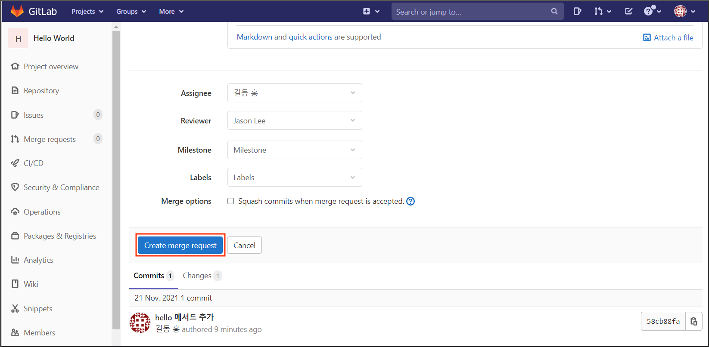

* Merge request가 생성되고 **Open** 상태입니다. GitLab의 무료(Free) 버전인 GitLab CE(Community Edition)에서 **Approve**는 선택사항입니다.

  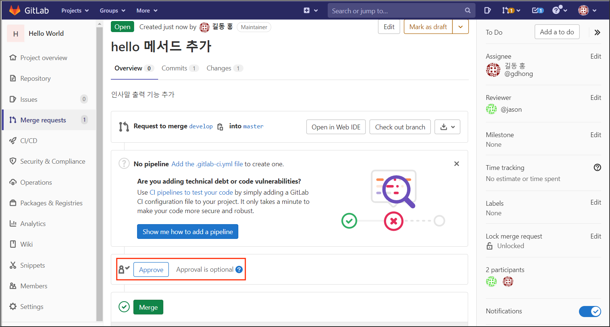

* **Maintainer** 또는 **Owner** 권한이 있는 사용자가 코드 리뷰 후, **Merge** 버튼을 클릭합니다.

  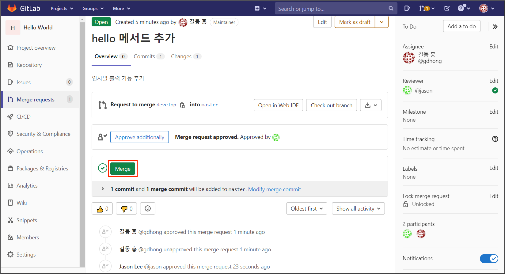

* Merge(병합)이 완료되면 `develop` 브랜치의 변경사항이 `master` 브랜치에 반영됩니다.

  > GitLab의 `master` 브랜치에 변경사항이 Merge(병합) 되면, 운영서버에 반영되도록 CD 파이프라인을 구성하여 실행할 수 있습니다.

  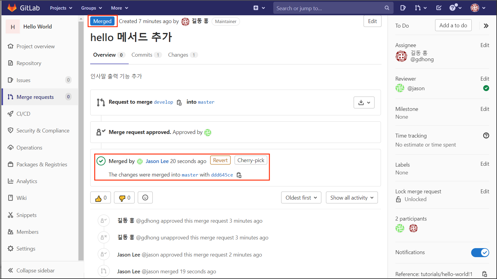

* GitLab 프로젝트의 **Repository > Commits** 페이지에서 `master` 브랜치에 Merge(병합)된 이력을 확인할 수 있습니다.

  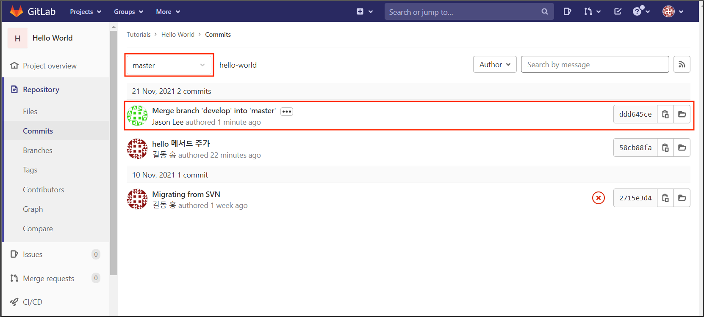

* GitLab의 Project overview 페이지에서 `master` 브랜치에 Merge(병합)된 소스 코드를 확인할 수 있습니다.

  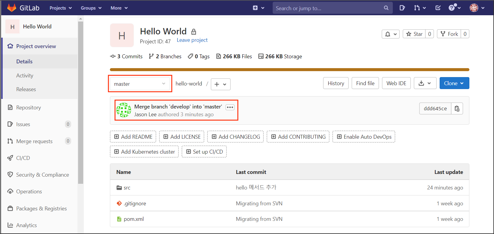

## Conflict(충돌) 해결

여러 개발자와 협업을 하는 경우, 소스 코드를 수정하고 변경사항을 Commit하고 Push하는 과정에서, 다른 개발자가 본인이 변경한 내용과 같은 부분을 수정하여 이미 Push하였다면 Conflict(충돌)이 발생합니다. 이런 경우 Conflict을 해결하기 위해 로컬 PC에서 충돌이 발생한 부분을 Merge(병합)하고 Push해야 합니다.

* Eclipse에서 소스 코드를 수정하면 Sourcetree의 파일 상태에서 변경된 내용을 확인할 수 있습니다.

  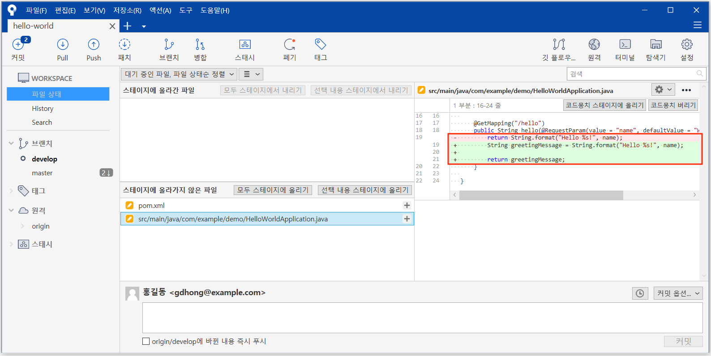

* **Pull** 버튼을 클릭하면 아래와 같이 Pull할 브랜치 선택 창이 나타납니다. **Pull** 버튼을 클릭합니다.

  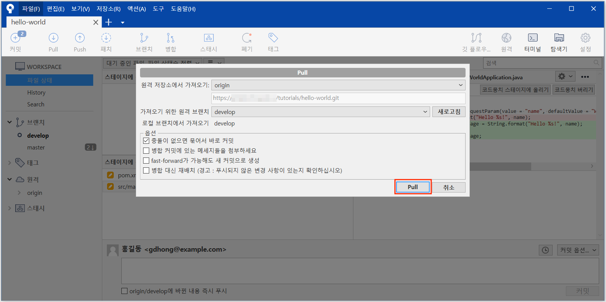

* Pull 진행 시 Conflict(충돌)이 없으면 로컬 저장소의 소스 코드에 자동 병합되고 바로 커밋을 할 수 있으나, 충돌이 있으면 아래와 같이 에러가 발생합니다. **닫기** 버튼을 클릭한 후, "Pull할 브랜치 선택 창"의 **취소** 버튼을 클릭합니다.

  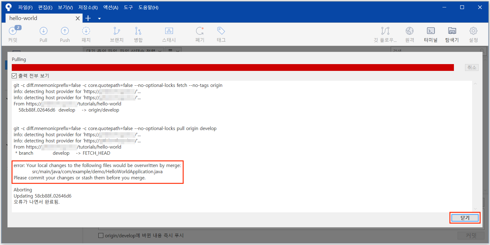

* 커밋할 파일을 선택하고 **선택 내용 스테이지에 올리기** 버튼을 클릭하여 스테이지에 올립니다. 커밋 메시지를 입력하고 **커밋** 버튼을 클릭합니다.

  > Pull 에러가 발생하였으나 변경된 파일을 Commit/Push하지 않아도 되는 경우, 파일을 선택하고 마우스 우클릭한 후, **폐기(Discard)** 를 선택하면, 파일의 변경한 내용을 무시하고 원래 상태로 돌리게 되어 Pull할 수 있습니다.

  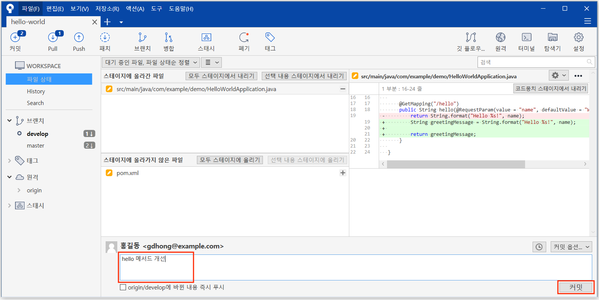

* **History**에 커밋 이력이 추가된 것을 확인할 수 있습니다. **Pull** 버튼을 클릭합니다.

  > **Push** 버튼을 클릭하면, 원격 저장소에서 Push가 거부되며 "error: failed to push some refs to 'https://xxx.xxxxx.xxx/tutorials/hello-world.git'" 메시지의 에러가 발생합니다.

  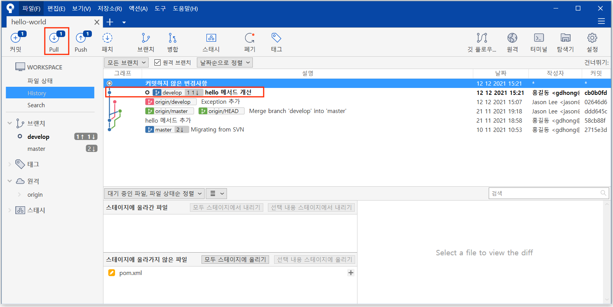

* **Pull** 버튼을 클릭합니다.

  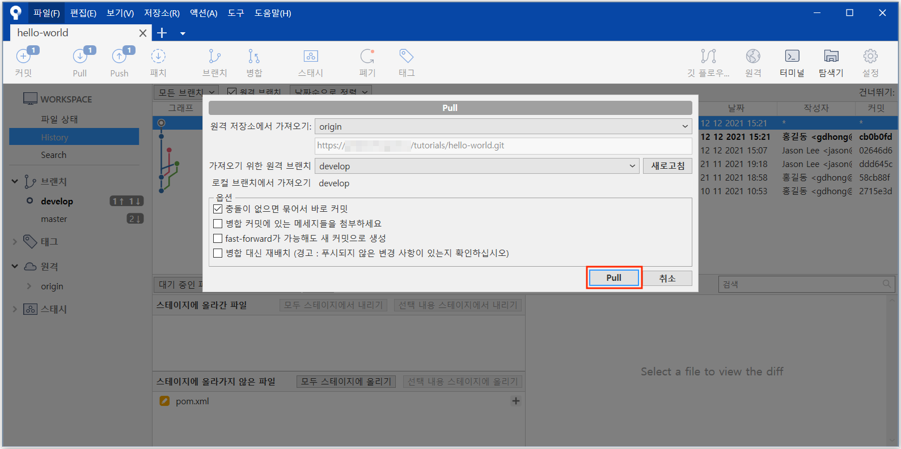

* Pull 진행 시 로컬 저장소의 소스 코드와 병합하면서 Conflict(충돌)이 발생하면 아래와 같이 **충돌 병합(Merge Conflicts)** 창이 나타납니다.

  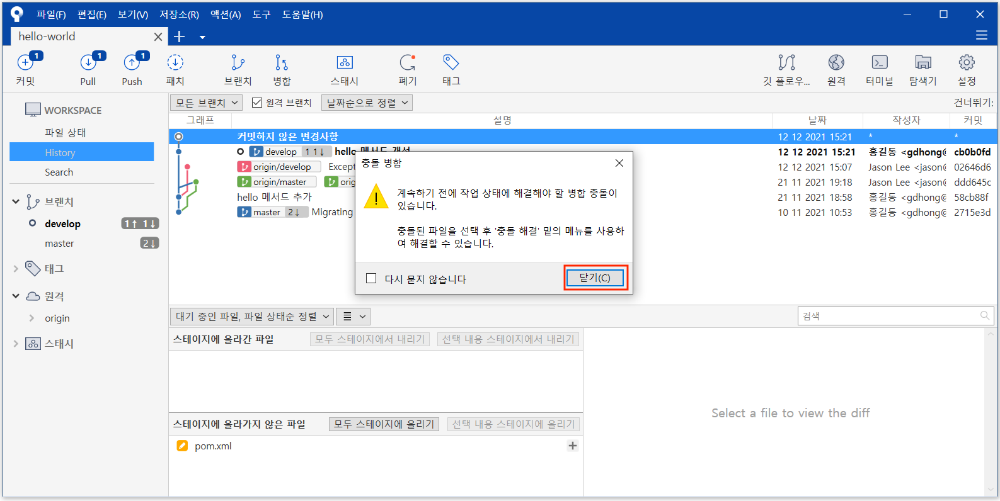

* 충돌이 있는 파일에 **충돌 아이콘**이 표시되며, 파일을 선택하면 오른쪽 패널에 충돌된 부분을 확인할 수 있습니다.

  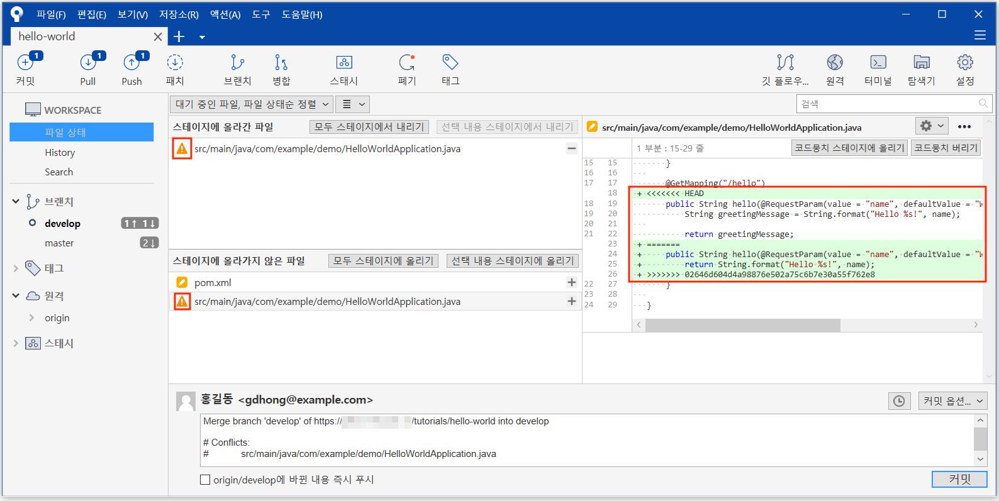

* Eclipse에서 충돌된 부분이 있는 파일을 열어, Conflict(충돌)을 해결해야 합니다.

  > `<<<<<<< HEAD`와 `=======` 사이의 내용은 로컬 저장소의 현재 브랜치에 있는 내용이며, `=======`와 `>>>>>>> 02646d...(커밋 ID)` 사이의 내용은 원격 저장소에 있는 내용입니다.

  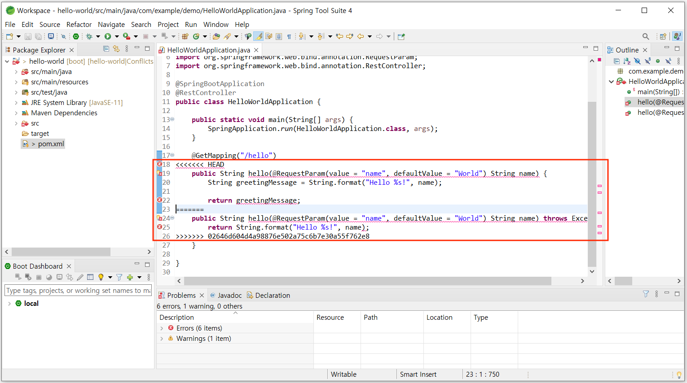

* 아래와 같이 Conflict(충돌)이 있는 부분을 수정하여 병합(Merge)합니다.

  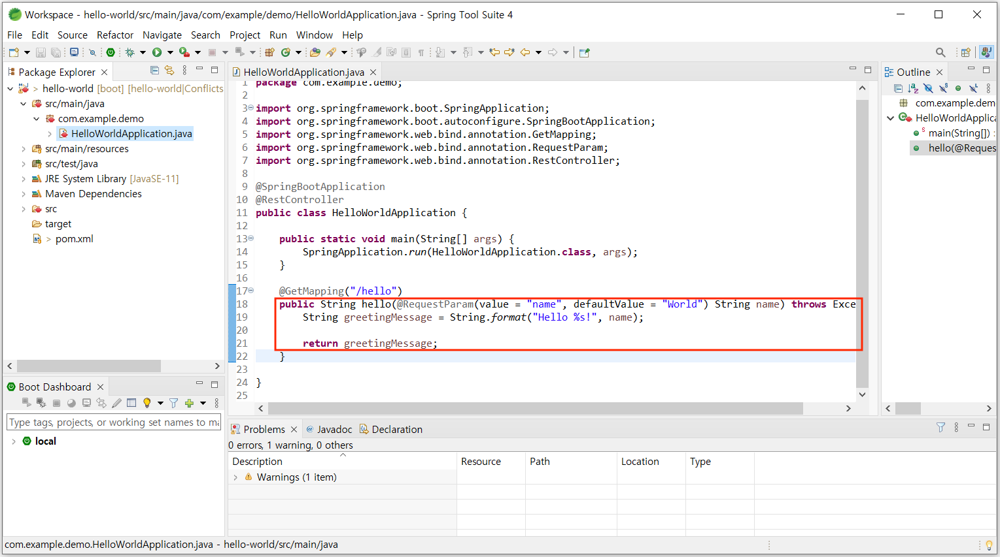

* Conflict(충돌)을 해결하고 병합(Merge)한 파일을 선택하고 **선택 내용 스테이지에 올리기** 버튼을 클릭하여 스테이지에 올립니다.

  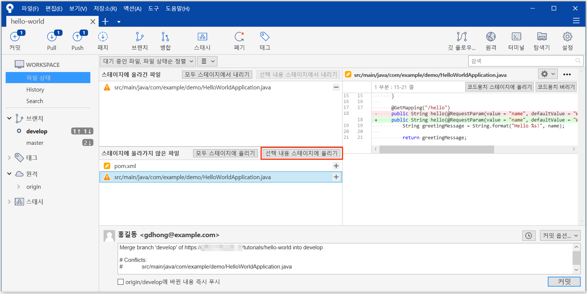

* **커밋** 버튼을 클릭합니다.

  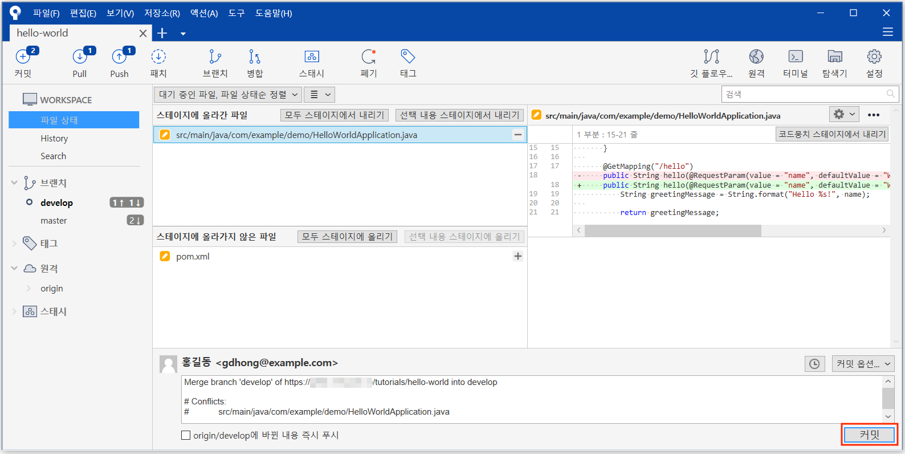

* **History**에 병합하여 커밋한 이력이 추가된 것을 확인할 수 있습니다. **Push** 버튼을 클릭합니다.

  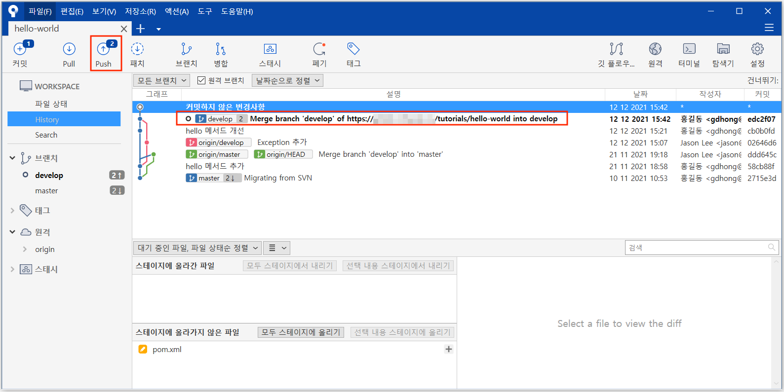

* 로컬 `develop` 브랜치를 체크하고 **Push** 버튼을 클릭합니다.

  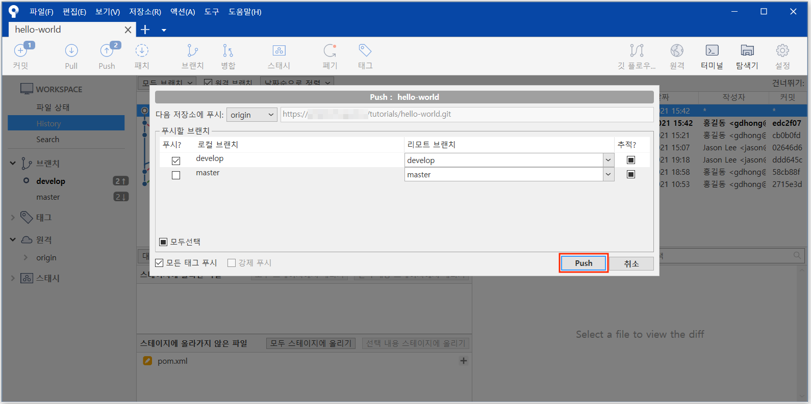

* **History**에서 `origin/develop`에 Push된 것을 확인할 수 있습니다.

  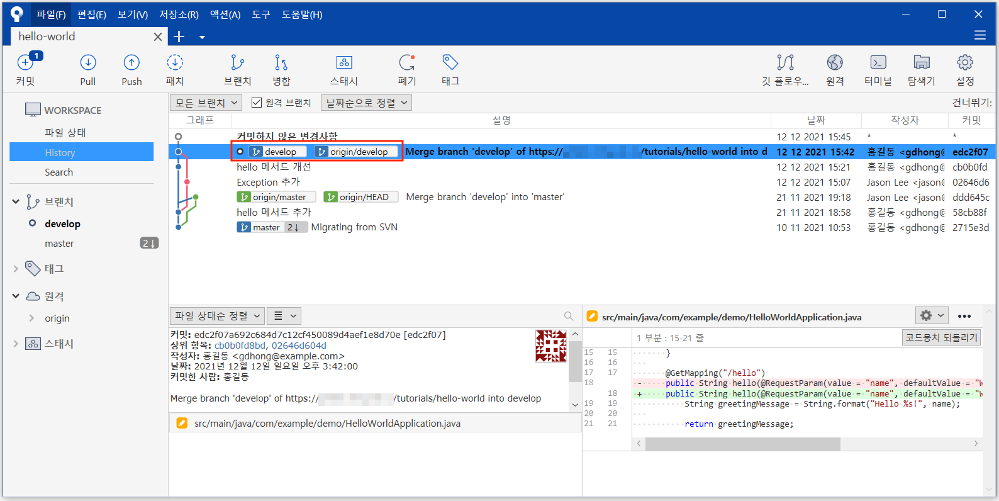

* GitLab 프로젝트의 **Repository > Commits** 페이지에서 커밋 내용을 확인할 수 있습니다.

  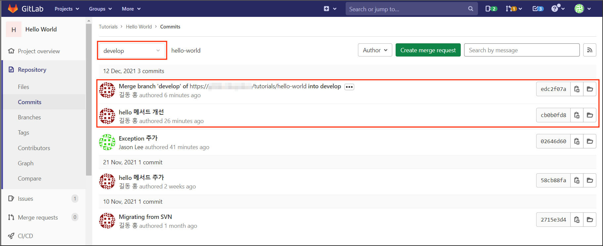
