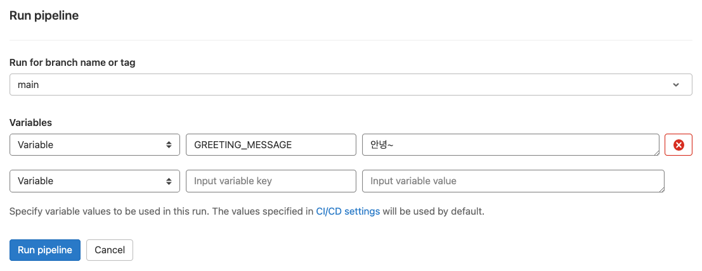

# GitLab CI 기초 가이드

본 가이드에서는 GitLab을 이용한 **지속적 통합(Continuous Integration, CI)** 환경 구축을 다룹니다. CI가 무엇이고, 왜 사용해야 하는지, 그리고 GitLab으로 **CI Pipeline**을 구성하는 방법을 설명합니다.  
**GitLab CI Pipeline**이 작동하는 방식 및 GitLab CI에 대한 특정 지침을 구성하는 YAML 파일인 `.gitlab-ci.yml`의 구성 요소를 이해할 수 있도록 작성되었습니다.

## GitLab CI/CD 소개

GitLab CI/CD는 모든 지속적 방법 (지속적 통합, 전달 및 배포)에 사용하는 GitLab의 일부입니다. GitLab CI/CD를 사용하면 타사 애플리케이션이나 통합 없이 소프트웨어를 테스트, 빌드 및 게시할 수 있습니다.

### CI/CD 개념

지속적 소프트웨어 개발 방법을 사용하면 반복적인 코드 변경사항을 지속적으로 빌드, 테스트 및 배포할 수 있습니다. 이 반복적인 프로세스는 버그가 있거나 실패한 이전 버전을 기반으로 새 코드를 개발할 가능성을 줄이는 데 도움이 됩니다. 이 방법을 사용하면 새 코드 개발부터 배포까지 사람의 개입을 줄이거나 전혀 개입하지 않으려고 노력합니다.

#### 지속적 통합(Continuous Integration, CI)

GitLab의 Git 저장소에 코드가 저장된 애플리케이션을 생각해 보십시오. 개발자는 매일, 하루에 여러 번 코드 변경사항을 푸시합니다. 리포지토리에 푸시할 때마다 스크립트 세트를 생성하여 애플리케이션을 자동으로 빌드하고 테스트할 수 있습니다. 이러한 스크립트는 애플리케이션에 오류가 발생할 가능성을 줄일 수 있습니다.

이 방법을 **지속적 통합**이라고 합니다. 애플리케이션에 제출된 각 변경사항은 개발 브랜치에도 자동으로 지속적으로 빌드되고 테스트됩니다. 이러한 테스트는 변경사항이 애플리케이션에 대해 설정한 모든 테스트, 지침 및 코드 준수 표준을 통과하도록 보장합니다.

#### 지속적 전달(Continuous Delivery, CD)

지속적 전달은 지속적 통합을 넘어서는 단계입니다. 코드 변경이 코드베이스에 푸시될 때마다 애플리케이션이 빌드되고 테스트될 뿐만 아니라 애플리케이션도 지속적으로 배포됩니다. 그러나 지속적 전달을 사용하면 배포를 수동으로 트리거합니다.

지속적 전달은 코드를 자동으로 확인하지만, 변경사항의 배포를 수동으로 전략적으로 트리거하려면 사람의 개입이 필요합니다.

#### 지속적 배포(Continuous Deployment, CD)

지속적 배포는 지속적 전달과 유사한 지속적 통합을 넘어서는 또 다른 단계입니다. 차이점은 애플리케이션을 수동으로 배포하는 대신 자동으로 배포되도록 설정한다는 것입니다. 사람의 개입이 필요하지 않습니다.

### GitLab CI/CD 워크플로우

GitLab CI/CD는 일반적인 개발 워크플로우에 적합합니다.


Issues에서 코드 구현에 대해 논의하고 제안된 변경사항에 대해 로컬에서 작업하는 것으로 시작할 수 있습니다. 그런 다음 GitLab에서 호스팅 되는 원격 저장소의 Feature 브랜치에 커밋을 푸시할 수 있습니다. 푸시는 프로젝트의 CI/CD 파이프라인을 트리거합니다.

그러면 GitLab CI/CD가 자동화된 스크립트(순차 또는 병렬)를 실행하여 다음을 수행합니다.

* 애플리케이션을 빌드하고 테스트합니다.
* 로컬 호스트에서 보는 것과 동일하게 리뷰 앱에서 변경사항을 미리 봅니다.

구현이 예상대로 작동하면 다음을 수행합니다.

* 코드를 검토하고 승인합니다.
* Feature 브랜치를 기본 브랜치에 병합합니다.
  * GitLab CI/CD는 변경사항을 프로덕션 환경에 자동으로 배포합니다.

문제가 발생하면 변경사항을 롤백할 수 있습니다.

### GitLab CI/CD 용어 및 개념

GitLab CI/CD는 다양한 개념과 용어를 사용하여 빌드 및 배포를 설명하고 실행합니다.

#### Pipelines

파이프라인은 지속적 통합, 전달 및 배포의 최상위 구성 요소입니다.

파이프라인은 다음으로 구성됩니다.

* 수행할 작업을 정의하는 Jobs. 예를 들어, 코드를 컴파일하거나 테스트하는 Job.
* 작업을 실행할 시기를 정의하는 Stages. 예를 들어, 코드를 컴파일하는 단계 후에 테스트를 실행하는 단계.

Job은 러너에 의해 실행됩니다. 동시(concurrent) 러너가 충분한 경우, 동일한 단계의 여러 Job이 병렬로 실행됩니다.  
한 단계의 모든 Job이 성공하면, 파이프라인은 다음 단계로 넘어갑니다.  
한 단계의 어떤 Job이 실패하면, 다음 단계는 (일반적으로) 실행되지 않고 파이프라인이 일찍 종료됩니다.

일반적으로 파이프라인은 자동으로 실행되며 생성된 후에는 개입이 필요하지 않습니다. 그러나 수동으로 파이프라인과 상호 작용할 수 있는 경우도 있습니다.

#### Jobs

파이프라인 구성은 Job으로 시작됩니다. Job은 `.gitlab-ci.yml` 파일의 가장 기본적인 요소입니다.  
Job은 Runner가 실행해야 하는 명령 모음입니다. Job의 결과물(Output)이 무엇인지 실시간으로 볼 수 있으므로, 개발자는 Job이 실패한 이유를 이해할 수 있습니다.

Job은 :

* 어떤 조건에서 실행되어야 하는지를 명시하는 제약 조건으로 정의됩니다.
* 임의의 이름을 가진 최상위 요소이며 최소한 script 절을 포함해야 합니다.
* 정의할 수 있는 수에는 제한이 없습니다.

예를 들면 :

```bash
job1:
  script: "execute-script-for-job1"

job2:
  script: "execute-script-for-job2"
```

위의 예는 각 Job이 서로 다른 명령을 실행하는 두 개의 개별 Job이 있는 가장 간단한 CI/CD 구성입니다.

#### Variables

CI/CD 변수는 환경 변수의 한 유형입니다. 이를 사용하여 다음을 수행할 수 있습니다.

* Jobs 및 파이프라인의 동작을 제어
* 재사용하려는 값을 저장
* `.gitlab-ci.yml` 파일에 값을 하드 코딩하는 것을 방지

GitLab CI/CD에는 파이프라인 구성 및 Job 스크립트에서 사용할 수 있는 [사전 정의된 CI/CD 변수의 기본 세트](https://docs.gitlab.com/ee/ci/variables/predefined_variables.html)가 있습니다.

`.gitlab-ci.yml`에서 미리 정의된 CI/CD 변수를 먼저 선언하지 않고도 사용할 수 있습니다.

이 예에서는 `CI_JOB_STAGE` 사전 정의된 변수를 사용하여 Job의 단계를 출력하는 방법을 보여줍니다.

```bash
test_variable:
  stage: test
  script:
    - echo "$CI_JOB_STAGE"
```

위 스크립트는 `test_variable` Job의 `stage`인 `test`를 출력합니다.

#### Environments

환경은 코드가 배포되는 위치를 설명합니다.

GitLab CI/CD가 환경에 코드 버전을 배포할 때마다 배포(Deployment)가 생성됩니다.

GitLab :

* 각 환경에 대한 전체 배포 이력을 제공합니다.
* 배포를 추적하므로 서버에 배포된 항목을 항상 알 수 있습니다.

프로젝트와 연결된 [Kubernetes](https://docs.gitlab.com/ee/user/project/clusters/index.html)와 같은 배포 서비스가 있는 경우, 이를 사용하여 배포를 지원할 수 있습니다.

#### Runners

GitLab CI/CD에서 러너는 `.gitlab-ci.yml`에 정의된 코드를 실행합니다. 러너는 GitLab CI/CD의 코디네이터 API를 통해 CI Job을 선택하고, Job을 실행한 다음, 결과를 GitLab 인스턴스로 다시 보내는 경량의 확장성이 뛰어난 에이전트입니다.

러너는 관리자가 생성하며 GitLab UI에 표시됩니다. 러너는 특정 프로젝트에 한정되거나 모든 프로젝트에서 사용할 수 있습니다.

GitLab UI에는 액세스 할 사용자에 따라 세 가지 유형의 러너가 있습니다.

* 공유 러너(Shared runners)는 GitLab 인스턴스의 모든 그룹 및 프로젝트에서 사용할 수 있습니다.
* 그룹 러너(Group runners)는 그룹의 모든 프로젝트와 하위 그룹에서 사용할 수 있습니다.
* 특정 러너(Specific runners)는 특정 프로젝트와 연결됩니다. 일반적으로 특정 러너는 한 번에 하나의 프로젝트에 사용됩니다.

#### Artifacts

단계(Stages) 간에 전달되는 단계 결과에 사용합니다.

아티팩트는 저장 및 업로드할 수 있도록 Job에 의해 생성되는 파일입니다. 동일한 파이프라인의 이후 단계의 Job에서 아티팩트를 가져와 사용할 수 있습니다. 한 단계의 Job에서 아티팩트를 생성하여 동일한 단계의 다른 Job에서 이 아티팩트를 사용할 수 없습니다. 이 데이터는 다른 파이프라인에서 사용할 수 없지만 UI에서 다운로드할 수 있습니다.

애플리케이션을 빌드하는 동안 모듈을 다운로드하는 경우, 이를 아티팩트로 선언하고 후속 단계의 Job에서 이를 사용할 수 있습니다.

#### Cache

프로젝트 의존성(Dependencies)을 저장하는 데 사용합니다.

캐시는 후속 파이프라인에서 지정된 Job의 속도를 높일 수 있습니다. 인터넷에서 다시 가져올 필요가 없도록 다운로드 한 의존성을 저장할 수 있습니다. 의존성에는 Maven 의존성 라이브러리, npm 패키지, Go의 vendor 패키지 등이 포함됩니다. 단계 간에 중간 빌드 결과를 전달하도록 캐시를 구성할 수 있지만 대신 아티팩트를 사용해야 합니다.

### GitLab CI/CD 빠른 시작

GitLab CI/CD를 시작하기 전에 다음 사항을 확인합니다.

* CI/CD를 사용하려는 GitLab의 프로젝트
* 프로젝트에 대한 Maintainer 또는 Owner 액세스 권한

#### CI/CD 프로세스 개요

GitLab CI/CD를 사용하려면 :

1. Job을 실행할 수 있는 Runner가 있는지 확인합니다. 러너가 없는 경우 [GitLab Runner를 설치](https://docs.gitlab.com/runner/install/)하고 인스턴스, 프로젝트 또는 그룹에 대한 [러너를 등록](https://docs.gitlab.com/runner/register/)합니다.
2. `.gitlab-ci.yml` 파일을 리포지토리의 루트에 생성합니다. 이 파일은 CI/CD Job을 정의하는 곳입니다.

파일을 리포지토리에 커밋하면 러너가 Job을 실행합니다. Job 결과는 파이프라인에 표시됩니다.

#### Runner를 사용할 수 있는지 확인

GitLab에서 Runner는 CI/CD Job을 실행하는 에이전트입니다. GitLab 인스턴스의 모든 프로젝트에서 사용할 수 있는 공유 러너(Shared runners)를 포함하여 프로젝트에 사용할 수 있는 러너가 이미 있을 수 있습니다.

사용 가능한 러너를 보려면 :

* **Settings > CI/CD**로 이동하여 **Runners**를 확장합니다.

활성 상태인 러너가 하나 이상 있고 그 옆에 녹색 원이 있으면, Job을 처리할 수 있는 러너가 있는 것입니다.

UI의 **Runners** 페이지에 러너가 나열되지 않으면, 사용자 또는 시스템 관리자가 GitLab Runner를 설치하고 하나 이상의 러너를 등록해야 합니다.

Runner는 윈도우, 리눅스, 맥 어디에나 설치할 수 있습니다.

CI/CD를 테스트하는 경우, 로컬 컴퓨터에 GitLab Runner를 설치하고 러너를 등록할 수 있습니다. CI/CD Job이 실행되면 로컬 컴퓨터에서 실행됩니다.

#### .gitlab-ci.yml 파일 생성

`.gitlab-ci.yml` 파일은 GitLab CI/CD에 대한 특정 지침을 구성하는 YAML 파일입니다.

이 파일에서 다음을 정의합니다.

* 러너가 실행해야 하는 작업(Job)의 구조와 순서
* 특정 조건이 발생할 때 러너가 내려야 하는 결정

예를 들어, `master`를 제외한 브랜치에 커밋할 때 테스트 모음을 실행할 수 있습니다. `master`에 커밋하면 동일한 테스트 슈트(Test Suite)를 실행하고 애플리케이션도 게시하려고 합니다.

이 모든 것은 `.gitlab-ci.yml` 파일에 정의되어 있습니다.

## GitLab CI 실습

특정 프로그램에 구애받지 않고 GitLab CI Pipeline의 구성 요소와 개념을 이해할 수 있도록 소스 코드 없이 Job 로그에 텍스트를 출력하는 방식의 실습입니다.

### 프로젝트 생성

기본 CI 파이프라인 실습하기 위한 개인 프로젝트를 생성합니다.


* **[+]** 아이콘을 클릭하고 **New project**를 선택합니다.
* **Create new project** 페이지에서 **Create blank project**를 클릭합니다.
* **Create blank project** 페이지에서 아래 항목을 입력 또는 선택하고 **Create project** 버튼을 클릭합니다.

  * **Project name** : `Hello GitLab CI` 입력
  * **Visibility Level** : `Private` 선택
  * **Initialize repository with a README** 체크

### `.gitlab-ci.yml` 파일 생성

다음을 수행하여 `.gitlab-ci.yml` 파일을 생성합니다.

* GitLab UI의 **Project overview > Details** 페이지에서 project slug(`hello-gitlab-ci`) 오른쪽에 있는 **[+]** 아이콘을 클릭하고 **New file**을 선택합니다.
* **File name** 필드에 `.gitlab-ci.yml`를 입력합니다.
* 아래 내용을 복사하여 붙여넣습니다.

    ```yaml
    stages:
      - build
      - test

    image: alpine:latest

    variables:
      GREETING_MESSAGE: Hello

    build_a:
      stage: build
      script:
        - echo "$GREETING_MESSAGE, GitLab CI!"
        - echo "이 Job은 무언가를 빌드합니다."

    build_b:
      stage: build
      script:
        - echo "이 Job은 다른 무언가를 빌드합니다."
        - sleep 5

    test_a:
      stage: test
      script:
        - echo "이 Job은 무언가를 테스트합니다."
        - echo "빌드 단계의 모든 Job이 완료된 경우에만 실행됩니다."

    test_b:
      stage: test
      script:
        - echo "이 Job은 다른 무언가를 테스트합니다."
        - echo "이 Job도 빌드 단계의 모든 Job이 완료된 경우에만 실행됩니다."
        - echo "test_a와 거의 동시에 시작됩니다."
        - sleep 5
    ```

* Commit changes 버튼을 클릭합니다.

### 결과 확인

CI/CD > Pipelines 페이지에서 실행 중인 파이프라인을 클릭하면, 단계 별로 Job이 실행되는 것을 확인할 수 있습니다.


각 Job을 클릭하여 로그를 확인합니다.

* `build_a` Job 로그


* `build_b` Job 로그


* `test_a` Job 로그


* `test_b` Job 로그


### 수동으로 파이프라인 실행

CI 파이프라인을 수동으로 실행할 수 있습니다.

* **CI/CD > Pipelines** 페이지에서 우측 상단의 **Run Pipeline** 버튼을 클릭합니다.
* Run Pipeline 페이지의 **Variables** 섹션에서 **Input variable key**에 `GREETING_MESSAGE`, **Input variable value**에 원하는 인사말을 입력합니다.
* **Run Pipeline** 버튼을 클릭합니다.



**CI/CD > Pipelines** 페이지에서 실행 중인 파이프라인을 클릭한 후, `build_a` Job을 클릭하면 로그에 입력한 인사말이 출력되는 것을 확인할 수 있습니다.

```bash
(생략)

Executing "step_script" stage of the job script
$ echo "$GREETING_MESSAGE, GitLab CI!"
안녕~, GitLab CI!
$ echo "이 Job은 무언가를 빌드합니다."
이 Job은 무언가를 빌드합니다.
Cleaning up file based variables
Job succeeded
```
