# 시스템별 CoDY 적용 가이드

본 가이드에서는 기존 CVS/SVN으로 버전 관리하고 있던 각 시스템의 코드베이스(소스 코드)를 CoDY-SCM(GitLab)에 등록(Push)하고 CI/CD 파이프라인을 구성하는 방법을 설명합니다. 또한 요구사항에 따라 개발한 후, GitLab CI/CD를 통해 개발/운영 서버에 배포하는 방법을 설명합니다.

본 가이드에 따라 시스템별 CoDY 적용하기에 앞서 [GitLab 사용 가이드](07_GitLab_Basic_CI.md)와 [GitLab CI 기초 가이드](07_GitLab_Basic_CI.md) 문서를 읽어 보길 바랍니다.

## Workflow

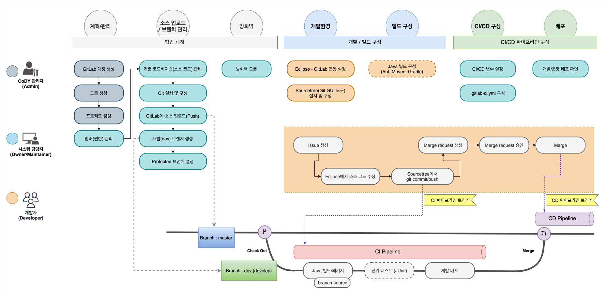

* **CoDY 관리자 (Admin 권한)**
  * 사용자가 신청한 계정을 승인하거나 직접 등록하여 GitLab 계정을 생성합니다.
  * GitLab의 그룹과 프로젝트를 생성합니다.

    > [LDAP](https://docs.gitlab.com/ee/administration/auth/ldap/index.html), [Crowd](https://docs.gitlab.com/ee/administration/auth/crowd.html) 연동하거나, 각 사용자가 신청한 계정을 승인하여 관리할 수 있습니다. 또는 관리자가 직접 **Admin Area > Users** 메뉴를 통해 계정을 생성할 수 있습니다.

* **시스템 담당자 (Owner/Maintainer)**
  * 각 시스템 담당자는 팀원(개발자)들을 시스템에 해당하는 GitLab 프로젝트의 멤버로 추가하고 `Developer` 권한을 부여합니다.
  * 시스템의 코드베이스를 GitLab의 Repository에 업로드(Push)합니다.
  * 개발(`dev`) 브랜치를 생성하고 **Settings > Repository** 메뉴의 **Protected branches**에서 `master` 및 `dev` 브랜치가 삭제되는 것을 방지하는 설정과 Merge 및 Push 허용 권한을 설정합니다.
  * CoDY를 통해 개발/운영 서버에 배포하기에 필요한 방화벽을 오픈합니다.
  * **Settings > CI/CD** 메뉴의 **Variables**에서 개발/운영 서버의 Host, 계정, 패스워드, 배포 경로 등 `.gitlab-ci.yml`에서 필요한 CI/CD 변수를 등록합니다.
  * GitLab CI/CD를 통해 소스 코드와 리소스를 빌드 및 패키징하여 개발/운영 서버에 배포되도록 `.gitlab-ci.yml` 파일을 구성합니다.
  * 개발/운영 서버에 정상적으로 배포되었는지 확인합니다.
* **개발자 (Developer)**
  * Eclipse에 구성된 코드베이스가 GitLab 프로젝트의 Repository와 연동되도록 설정합니다.
  * Git GUI 클라이언트인 **Sourcetree**을 설치하고 로컬 저장소를 구성합니다.
  * Ant, Maven, Gradle 등 Java 빌드 도구를 이용하여 Windows 명령 프롬프트(CMD) 또는 Linux 셸에서 CLI(Command Line Interface)으로 빌드 및 패키지할 수 있도록 구성합니다.
  * 요구사항에 따라 이슈를 생성하고 Eclipse에서 `dev` 브랜치의 소스 코드를 수정한 후, Sourcetree에서 commit/push합니다.
  * GitLab에 Push되면 CI 파이프라인을 통해 개발 서버에 배포되는데, 배포 결과를 확인하고 Merge request를 생성합니다.

## GitLab 프로젝트 멤버 추가

**Maintainer**  
프로젝트 수정/삭제, 그룹 회원 관리 등 일부 기능을 제외하고 프로젝트 기능에 대한 대부분 권한을 가집니다. 운영 시스템 담당자, 주로 오토에버 정직원을 대상으로 권한을 부여합니다.

**Developer**  
개발 또는 유지보수를 담당하는 개발자에게 부여합니다. `dev` 브랜치에만 Push 할 수 있으며 `master` 브랜치에는 Push 할 수 없습니다. 할당된 업무를 진행하기 위해 이슈를 생성하고, 신규 기능 개발 또는 기존 기능 수정이 완료되면 소스를 `dev` 브랜치에 Push 후 워크플로우에 따라 Merge Request를 작성하여 승인을 요청합니다.

프로젝트의 Members 메뉴에서 추가할 사용자를 선택하거나 다른 그룹을 선택하여 구성원을 추가할 수 있습니다.

전제 조건 :

* **Maintainer** 또는 **Owner** 역할이 있어야 합니다.

프로젝트에 멤버를 추가하려면 :

1. 사이드 바에서 **Members**를 선택합니다.
2. **Invite member** 탭에서, **GitLab member or Email address** 필드에 사용자 이름 또는 이메일 주소를 입력합니다.
3. 역할 권한을 선택합니다.
4. (선택사항) 만료일을 선택합니다. 해당 날짜에 사용자는 더 이상 프로젝트에 액세스 할 수 없습니다.
5. **Invite** 버튼을 클릭합니다.

좀 더 상세한 내용은 [GitLab 사용 가이드의 멤버 설정](06_How_to_Use_GitLab.md#멤버-설정) 섹션을 참고하세요.

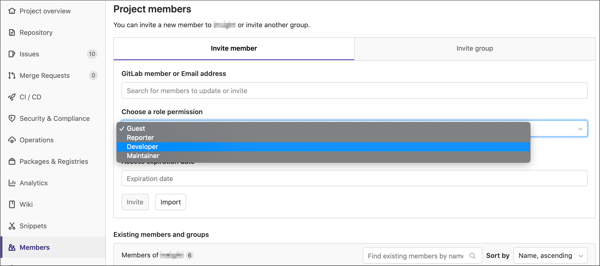

## GitLab에 코드베이스 업로드(Push)

기존 CVS/SVN으로 버전 관리하고 있는 코드베이스(소스코드)를 CoDY(GitLab)에 업로드(Push) 해야, Git 원격 저장소인 GitLab 프로젝트 Repository를 통해 버전 관리를 하고, GitLab CI/CD를 이용하여 소스 코드와 리소스를 빌드하고 패키징하여 개발/운영 서버에 배포할 수 있습니다.

* Git CLI(Command Line Interface)를 사용하여 업로드(Push)하려면 [GitLab에 코드베이스 Push 가이드](02_Push_Codebase_to_GitLab.md) 문서를 참고하여 진행하십시오.
* Git 명령어에 익숙하지 않으면 [Sourcetree로 GitLab에 코드베이스 Push 하기](03_Push_Codebase_to_GitLab_with_Sourcetree.md) 문서를 참고하여 업로드(Push) 합니다.

## GitLab 브랜치 생성 및 설정

개발자가 개발을 완료하고 변경사항을 `dev` 브랜치에서만 Push 또는 Merge 할 수 있도록 하고, `master` 브랜치에 변경사항이 Merge request(MR)을 통해서만 반영되도록 `dev` 브랜치를 생성하고 Protected 브랜치 설정을 합니다.

### `dev` 브랜치 생성

개발을 진행하고 개발 서버에 배포되는 `dev` 브랜치를 생성를 생성합니다.

* 사이드 바에서 **Repository > Branches**를 선택합니다.
* **New branch** 버튼을 클릭합니다.

  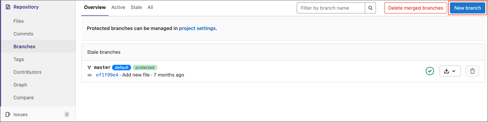

* **Branch name** 필드에 `dev`을 입력하고 **Create branch** 버튼을 클릭합니다.

  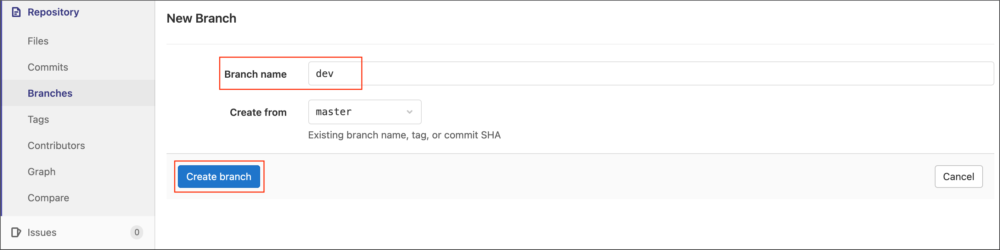

### Protected 브랜치 설정

실수로 브랜치가 삭제되는 것을 방지하고, 브랜치별 Merge 및 Push에 대한 허용 권한을 설정합니다.

* 사이드 바에서 **Settings > Repository**를 선택합니다.
* **Protected branches** 섹션을 확장합니다.
* 아래 항목을 선택하고 **Protect** 버튼을 클릭합니다.
  * **Branch** : `dev` 브랜치 선택
  * **Allowed to merge** : `Maintainer + Developer` 선택
  * **Allowed to push** : `Maintainer + Developer` 선택

  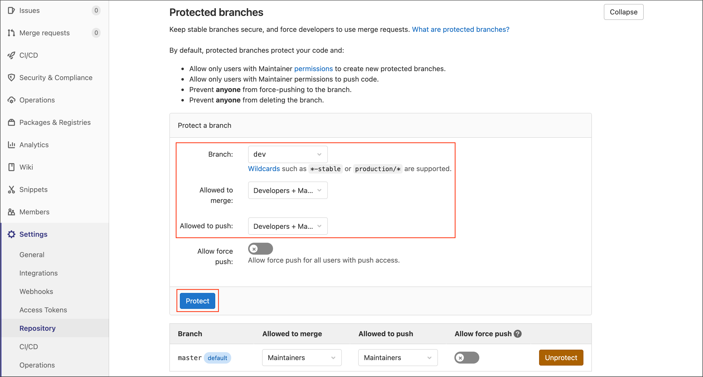

* `master` 브랜치의 **Allowed to push**를 `No one`으로 변경합니다. 이렇게 하면, 아무도 직접 Push하지 못하게 하여 Merge request를 통해서만 `master` 브랜치에 변경사항이 반영되도록 설정됩니다.

  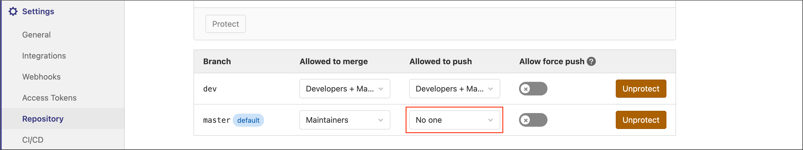

## 로컬 개발환경 구성

CoDY-ECM의 [Eclipse 프로젝트 - GitLab 연동](https://cody-ecm.autoever.com/pages/viewpage.action?pageId=219157355) 문서를 참고하여, Eclipse에 구성된 코드베이스가 GitLab 프로젝트의 Repository와 연동되도록 설정합니다.

Eclipse의 Git 플러그인을 사용하여 소스 코드 변경사항을 Commit/Push할 수도 있으나, Conflict이 발생하면 해결하기 어렵습니다. **Sourcetree**를 사용하면 GUI 환경에서 좀 더 쉽게 Commit/Push하고, Conflict를 해결할 수 있습니다.

[Sourcetree로 GitLab에 코드베이스 Push 하기](03_Push_Codebase_to_GitLab_with_Sourcetree.md) 문서의 [Sourcetree 설치](03_Push_Codebase_to_GitLab_with_Sourcetree.md#sourcetree-설치)와 [Git 저장소 추가](03_Push_Codebase_to_GitLab_with_Sourcetree.md#git-저장소-추가) 섹션을 참고하여, **Sourcetree**르 설치하고 로컬 저장소를 구성합니다.

## Java 빌드 환경 구성

GitLab의 CI/CD 파이프라인은 [GitLab Runner](https://docs.gitlab.com/runner/)에 의해 CI/CD Job이 실행됩니다.  
Java 소스 코드와 리소스를 빌드하고 Zip 또는 Jar/War 파일로 패키징하는 Job과 SFTP 또는 SSH를 통해 개발/운영 서버에 배포하는 Job은 Runner 상의 Linux Shell에서 CLI(Command Line Interface)으로 실행됩니다. (Eclipse에서 컴파일된 파일들을 GUI 환경에서 FTP로 전송하는 방식으로는 GitLab CI/CD 파이프라인을 실행할 수 없습니다.)

Linux Shell에서 명령어를 실행하여 빌드하고 패키징하려면 Java 빌드 도구인 Ant, Maven, Gradle 구성이 필요합니다.

* Ant - build.xml
* Maven - pom.xml
* Gradle - build.gradle

Java 8 이상의 프로젝트는 Gradle, Java 7 이상에서는 Maven 사용을 권장하며, 그 외 의존성 라이브러리의 버전 정보 확인이 어렵거나 오래된 JDK이면 Ant를 사용하십시오.


### ★★ Maven 빌드 구성 (Build를 Maven으로 구성 시) 

[Apache Maven](https://maven.apache.org/index.html)는 프로젝트 객체 모델(Project Object Model, POM)이라는 개념을 바탕으로 프로젝트 의존성 관리, 프로젝트 라이프사이클 관리 기능 등을 제공하는 Java용 프로젝트 관리도구로 Apache Ant의 대안으로 만들어졌습니다.  
Ant와 마찬가지로 프로젝트의 소스 코드를 컴파일(compile), 테스트(test), 패키지(package)할 수 있습니다.

[Download](https://maven.apache.org/download.cgi) 페이지에서 다운로드 받아 설치할 수 있습니다.  
현재 Apache Maven 3.8.4가 최신 릴리스 버전이며 JDK 1.7 이상이 필요합니다.  
JDK 5에서는 Maven 3.1.1 버전, JDK 6에서는 3.2.5 버전이 죄종 버전입니다.  
[Maven Releases History](https://maven.apache.org/docs/history.html) 페이지에서 Maven 버전별 필요한 Java 버전을 확인할 수 있습니다.

Maven 프로젝트는 루트 디렉토리에 `pom.xml`을 생성하여 프로젝트에 대한 POM(프로젝트 개체 모델)을 정의하여야 합니다.  
모든 `pom.xml`은 Maven이 기존적으로 제공하는 [Super POM](https://maven.apache.org/ref/3.8.4/maven-model-builder/super-pom.html)에 상속됩니다. 재정의하지 않으면 이 Super POM이 기본값으로 적용됩니다.

#### POM 핵심 요소

아래 POM은 Maven이 허용하는 최소한의 구성입니다. `groupId:artifactId:version`은 모두 필수 필드입니다. (하지만 groupId 및 version은 parent로부터 상속되는 경우, 명시적으로 정의할 필요가 없습니다.) 세 개의 필드는 하나의 주소와 타임스탬프처럼 작동합니다. 이것은 Maven 프로젝트의 좌표계처럼 작동하는 저장소의 특정 위치를 표시합니다.

* **project** : 모든 Maven pom.xml 파일의 최상위 요소입니다.
* **modelVersion** : 이 요소는 이 POM이 사용 중인 개체 모델의 버전을 나타냅니다. 모델 자체의 버전은 매우 드물게 변경되지만 Maven 개발자가 모델 변경이 필요하다고 판단되는 경우 사용의 안정성을 보장하기 위해 필수(mandatory)입니다.
* **groupId** : 이 요소는 프로젝트를 생성한 조직 또는 그룹의 고유 식별자를 나타냅니다. dot(.) 표기법의 groupId는 프로젝트가 포함된 패키지 구조와 일치할 필요는 없지만 따르는 것이 좋은 방법입니다. 일반적으로 도메인 이름을 역으로 표기합니다.
* **artifactId** : 이 요소는 이 프로젝트에 의해 생성되는 기본 아티팩트의 고유한 기본 이름을 나타냅니다. 프로젝트의 기본 아티팩트는 일반적으로 JAR 파일입니다. 소스 번들과 같은 보조 아티팩트도 최종 이름의 일부로 artifactId를 사용합니다. Maven에서 생성된 일반적인 아티팩트는 `<artifactId>-<version>.<extension>` 형식을 갖습니다. (예: myapp-1.0.jar)
* **version** : 이 요소는 프로젝트에서 생성된 아티팩트의 버전을 나타냅니다. Maven은 버전 관리에 많은 도움이 되며 프로젝트가 개발 상태에 있음을 나타내는 `SNAPSHOT` 지정자를 버전에서 자주 볼 수 있습니다.
* **packaging** : 이 요소는 아티팩트에서 사용할 패키지 유형을 나타냅니다. (예: JAR, WAR, EAR)
* **name** : 이 요소는 프로젝트에 사용되는 표시 이름을 나타냅니다. 이것은 Maven의 생성 문서에서 자주 사용됩니다.

```xml
<project xmlns="http://maven.apache.org/POM/4.0.0" xmlns:xsi="http://www.w3.org/2001/XMLSchema-instance"
    xsi:schemaLocation="http://maven.apache.org/POM/4.0.0 http://maven.apache.org/maven-v4_0_0.xsd">
    <modelVersion>4.0.0</modelVersion>

    <groupId>com.autoever.demo</groupId>
    <artifactId>sample</artifactId>
    <version>0.0.1-SNAPSHOT</version>
    <packaging>war</packaging>
    <name>Sample Maven Webapp</name>

...

```

#### Properties

Maven 프로퍼티(properties)은 Ant의 프로퍼티와 마찬가지로 설정 파일 내에서 반복적으로 사용되는 상수 값을 정의할 때 사용합니다. 해당 값은 `${X}` 표기법을 사용하여 POM 내 어디에서나 액세스할 수 있습니다. 여기서 `X`은 프로퍼티입니다. 또는 플러그인에서 기본값으로 사용할 수 있습니다.

```xml
...

    <properties>
        <project.build.sourceEncoding>UTF-8</project.build.sourceEncoding>
        <project.reporting.outputEncoding>UTF-8</project.reporting.outputEncoding>
        <java.version>1.6</java.version>
        <servlet.version>3.0.1</servlet.version>
        <spring.version>3.2.11.RELEASE</spring.version>
        <slf4j.version>1.7.7</slf4j.version>
        <logback.version>1.1.2</logback.version>
        <jackson.version>2.4.3</jackson.version>
    </properties>

...
```

#### Dependencies

Maven을 사용하기 이전의 Java Web 프로젝트에서는 직접 필요한 라이브러리를 다운로드 받아서 `WEB-INF/lib`에 위치시키고 IDE에 path를 설정하고 사용하였습니다. 직접 라이브러리를 찾고 설정하는 번거로움과 라이브러리의 버전을 관리하기가 어렵습니다. 또한, Excel 문서를 처리하는 [Apache POI](https://poi.apache.org/)와 REST API 요청 시 사용하는 [Apache HttpComponents](https://hc.apache.org/index.html)의 HttpClient 라이브러리는 의존성 라이브러리를 동일하게 [Apache Commons Codec](https://commons.apache.org/proper/commons-codec/)을 참조합니다. 참조하는 버전이 다르면 에러가 발생합니다.

Maven은 의존성 관리 기능을 통해 이러한 문제를 해결합니다.

```xml
...
    <dependencies>
...
        <dependency>
            <groupId>junit</groupId>
            <artifactId>junit</artifactId>
            <version>4.11</version>
            <scope>test</scope>
        </dependency>
    </dependencies>
...
```

* **groupId, artifactId, version** : 이 삼위일체는 특정 프로젝트의 Maven 좌표를 시간 내에 계산하는 데 사용되며, 이 프로젝트의 의존성으로 구분합니다.
* **scope** : 이 요소는 현재 작업(컴파일 및 런타임, 테스트 등)의 클래스 경로와 의존성의 전이성을 제한하는 방법을 나타냅니다. 5가지 범위를 사용할 수 있습니다.
  * **compile** - 아무 것도 지정되지 않은 경우 사용되는 기본 범위입니다. 컴파일 의존성은 모든 클래스 경로에서 사용할 수 있습니다. 또한 이러한 의존성은 의존 프로젝트에 전파됩니다.
  * **provided** - 이것은 컴파일과 매우 유사하지만 런타임에 JDK 또는 컨테이너가 이를 제공할 것으로 예상한다는 것을 나타냅니다. 컴파일 및 테스트 클래스 경로에서만 사용할 수 있으며 전이되지 않습니다.
  * **runtime** - 이 범위는 의존성이 컴파일에는 필요하지 않지만 실행에는 필요함을 나타냅니다. 런타임 및 테스트 클래스 경로에 있지만 컴파일 클래스 경로에는 없습니다.
  * **test** - 이 범위는 의존성이 애플리케이션의 일반적인 사용에 필요하지 않으며, 테스트 컴파일 및 실행 단계에서만 사용할 수 있음을 나타냅니다. 그것은 전이적이지 않습니다.
  * **system** - 이 범위는 명시적으로 포함하는 JAR을 제공해야 한다는 점을 제외하고 `provided`와 유사합니다. 아티팩트는 항상 사용 가능하며 저장소에서 조회되지 않습니다.

#### Profiles

**Maven 프로파일**은 프로젝트가 구축되는 환경에 따라 설정을 변경할 필요가 있는 경우, 특정 빌드 환경에 맞춘 리소스의 재배치 및 환경에 대한 옵션을 설정할 수 있는 기능입니다. 예를 들어, 테스트 환경을 위해 구축된 프로젝트는 운영 환경에 배포되는 것과 다른 데이터베이스를 가리킬 수 있습니다.

`mvn install -P[profile명]`와 같이 `-P` 옵션으로 실행하거나, `activation` 요소를 사용하여 `activeByDefault`을 `true`로 설정하면 기본 프로파일로 활성화됩니다.

```xml
...
    <profiles>
        <profile>
            <id>local</id>
            <activation>
                <activeByDefault>true</activeByDefault>
            </activation>
            <properties>
                <env>local</env>
            </properties>
        </profile>
        <profile>
            <id>dev</id>
            <properties>
                <env>dev</env>
            </properties>
        </profile>
        <profile>
            <id>prod</id>
            <properties>
                <env>prod</env>
            </properties>
        </profile>
    </profiles>
...
```

#### Build

`build` 요소는 프로젝트의 디렉토리 구조를 선언하고 빌드에서 사용할 플러그인 관리를 처리합니다.

```xml
...
    <build>
        <directory>${project.basedir}/target</directory>
        <finalName>${project.artifactId}-${project.version}</finalName>
        <sourceDirectory>${project.basedir}/src/main/java</sourceDirectory>
        <testSourceDirectory>${project.basedir}/src/test/java</testSourceDirectory>
        <outputDirectory>${project.build.directory}/classes</outputDirectory>
        <testOutputDirectory>${project.build.directory}/test-classes</testOutputDirectory>
        <filters>
            <filter>filters/config-${env}.properties</filter>
        </filters>
        <resources>
            <resource>
                <filtering>true</filtering>
                <directory>${project.basedir}/src/main/resources</directory>
            </resource>
        </resources>
        <testResources>
            <testResource>
                <directory>${project.basedir}/src/test/resources</directory>
            </testResource>
        </testResources>
        ...
  <build>
...
```

* **`${project.basedir}`** : `pom.xml` 파일이 포함된 디렉토리

  > 그 외의 `${project.*}` 속성은 POM의 `<project>` 요소를 기준으로 설정하여 계산된 값으로 대체하도록 구성할 수 있습니다.  
  > 예를들어, `${project.version}`, `${project.build.finalName}`, `${project.artifactId}`, `${project.build.directory}`와 같이 사용할 수 있습니다.

* **directory** : 빌드 결과로 생성되는 파일들이 위치할 디렉토리. 정의하지 않으면 기본값으로 `${project.basedir}/target`이 적용됩니다.
* **finalName** : 빌드 후 패키지 결과로 생성되는 번들 파일명. (파일 확장자 제외) 정의하지 않으면 기본값 `${project.artifactId}-${project.version}`가 적용됩니다. 예를들어, 패키징 결과로 `my-project-1.0.jar`이 생성됩니다.
* ***Directory** : 프로젝트의 디렉토리 구조를 정의합니다. 프로젝트에서 기본값을 사용하지 않는 경우, 재정의하여 사용합니다.
  * **sourceDirectory** : Java 소스 파일들이 있는 디렉토리
  * **testSourceDirectory** : JUnit을 이용한 단위 테스트 코드와 같은 Java 테스트 소스 파일들이 있는 디렉토리
  * **outputDirectory** : sourceDirectory의 소스를 컴파일한 결과물이 위치하는 디렉토리
  * **testOutputDirectory** : testSourceDirectory의 소스를 컴파일한 결과물이 위치하는 디렉토리
* **filters** : 필터링 설정을 수락하는 리소스에 적용되며, 프로퍼티(properties) 목록을 포함하는 `*.properties` 파일을 정의합니다. 즉, 필터 파일 내에 정의된 `name=value` 쌍이 빌드 시 리소스 내의 `${name}` 문자열을 대체합니다.

  > 예제에서는 `filters/config-local.properties`, `filters/config-dev.properties`, `filters/config-prod.properties` 파일에 정의되어 있는 `jdbc.url = jdbc:mysql://localhost:3306/my_db?useUnicode=true&characterEncoding=utf8`와 같은 값이 `src/main/resources/config.properties` 파일 내에 정의되어 있는 `jdbc.url = ${jdbc.url}` 값을 데체합니다.

* **resources** : `*.xml`, `*.properties`와 같은 리소스 파일들을 포함할 항목과 위치를 지정하는 요소
  * **filtering** : 이 리소스에 대해 필터링을 활성화할지 여부
  * **directory** : 이 리소스가 위치할 디렉토리 지정
* **testResources** : `testResource` 요소를 포함하며, `resource` 요소와 유사하지만 테스트 단계에서만 사용됩니다.

예제 프로젝트에서는 `finalName`, `filters`, `resources` 요소들을 재정의하여 사용하였습니다.

```xml
...
    <build>
        <finalName>ROOT</finalName>
        <filters>
            <filter>filters/config-${env}.properties</filter>
        </filters>
        <resources>
            <resource>
                <filtering>true</filtering>
                <directory>${project.basedir}/src/main/resources</directory>
            </resource>
        </resources>
        ...
  <build>
...
```

Maven에서 제공되는 모든 기능은 [플러그인](https://maven.apache.org/plugins/index.html)에 의해 수행됩니다.  
Build 플러그인을 지정하지 않아도 `mvn [Phase]` 형태로 명령을 실행하면, Maven이 각 단계(Phase)에 연결된 플러그인 정보를 알고 있기 때문에 해당 플러그인을 자동으로 다운로드 받아 실행합니다.  
`compile` 단계을 실행하면 [compiler 플러그인](https://maven.apache.org/plugins/maven-compiler-plugin/), `package` 단계을 실행하면 [war 플러그인](https://maven.apache.org/plugins/maven-war-plugin/)에 의해 자동적으로 수행됩니다.

예제 프로젝트에서는 compiler 플러그인의 구성에 `source`, `target`의 JDK 버전을 추가 정의하였습니다.

```xml
...
    <build>
        ...
        <plugins>
            <plugin>
                <groupId>org.apache.maven.plugins</groupId>
                <artifactId>maven-compiler-plugin</artifactId>
                <version>3.1</version>
                <configuration>
                    <source>${java.version}</source>
                    <target>${java.version}</target>
                </configuration>
            </plugin>
        </plugins>
    </build>
...
```

#### Lifecycle, Phases 및 Goals

Maven에는 기본적으로 제공되는 `clean`, `default`, `site`의 세 가지 Lifecycle이 있습니다.  
`default` 라이프사이클은 프로젝트 배포를 처리하고 `clean`는 이전 빌드 결과물 제거, `site`는 프로젝트의 사이트 문서 생성을 처리합니다.

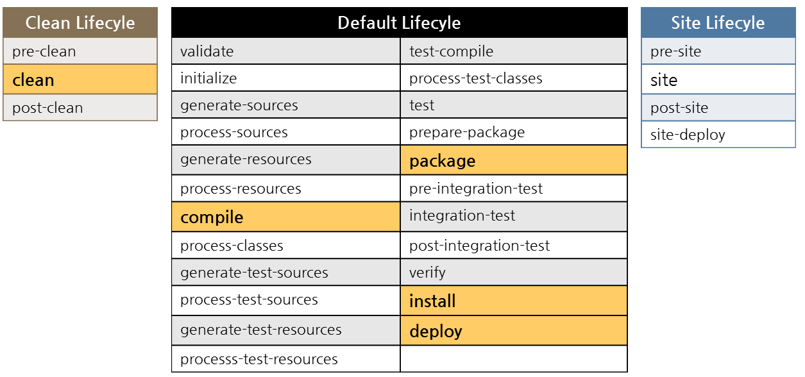

Phase는 Lifecycle의 각각의 단계를 의미합니다. Phase는 특정 순서에 따라서 Goal이 실행되도록 되어 있습니다.  
Phase 간에는 의존 관계가 있습니다. 예를 들어, `package` phase가 수행되기 위해서는 이전의 모든 phase가 순서대로 수행된 다음에 실행됩니다.

Goal은 Ant의 Target과 같은 개념으로 생각하면 됩니다. Maven에서 제공하는 모든 기능은 플러그인 기반으로 동작합니다.  
Phase를 실행하면 해당 Phase와 연결된 플러그인 Goal이 실행됩니다. (Goal은 `plugin:goal` 형태입니다.)

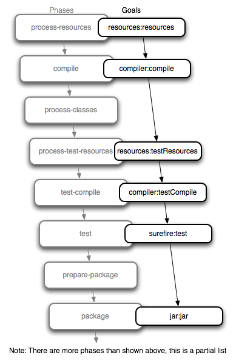

`mvn clean install` 명령을 실행하면 아래와 같은 순서로 Phase와 Goal이 실행됩니다.

* `clean` Phase
  * `clean:clean` Goal이 실행됩니다.
  * [Clean Plugin](https://maven.apache.org/plugins/maven-clean-plugin/)에 의해 target 디렉토리의 결과물을 모두 제거합니다.
* `process-resources` Phase
  * `resources:resources` Goal이 실행됩니다.
  * [Resources Plugin](https://maven.apache.org/plugins/maven-resources-plugin/)에 의해 `project.build.resources.resource.directory`에 있는 리소스를 `project.build.outputDirectory`에 생성합니다.
* `compile` Phase
  * `compiler:compile` Goal이 실행됩니다.
  * [Compiler Plugin](https://maven.apache.org/plugins/maven-compiler-plugin/)에 의해 `project.build.sourceDirectory`에 있는 소스 코드를 컴파일하여 클래스 파일들을 `project.build.outputDirectory`에 생성합니다.
* `test-compile` Phase
  * `compiler:testCompile` Goal이 실행됩니다.
  * [Compiler Plugin](https://maven.apache.org/plugins/maven-compiler-plugin/)에 의해 `project.build.testSourceDirectory`에 있는 테스트 소스 코드를 컴파일하여 클래스 파일들을 `project.build.testOutputDirectory`에 생성합니다.
* `test` Phase
  * `surefire:test` Goal이 실행됩니다.
  * [Surefire Plugin](https://maven.apache.org/surefire/maven-surefire-plugin/)에 의해 JUnit과 같은 테스트 코드를 실행하여 `target/surefie-reports` 디렉토리 안에 test 리포트 파일을 생성합니다.
  * `-DskipTests` 옵션으로 테스트를 건너뛸 수 있습니다.
* `package` Phase
  * 패키징 유형에 따라 `jar:jar` 또는 `war:war` Goal이 실행됩니다.
  * [Jar Plugin](https://maven.apache.org/plugins/maven-jar-plugin/) 또는 [WAR Plugin](http://maven.apache.org/plugins/maven-war-plugin/)에 의해 패키징 결과물인 Jar/War 파일을 target 디렉토리에 생성합니다.
* `install` Phase
  * `install:install` Goal이 실행됩니다.
  * [Install Plugin](http://maven.apache.org/plugins/maven-install-plugin/)에 의해 Jar/War 파일을 Local Repository에 등록합니다.


### ★★ Ant 빌드 구성 (Build를 Ant로 구성 시)

[Apache Ant](https://ant.apache.org/)는 전통적인 Java 빌드 도구로, [Binary Distributions](https://ant.apache.org/bindownload.cgi) 페이지에서 다운로드 할 수 있습니다.

현재 Apache Ant 1.9.16 및 1.10.12가 가장 최신의 사용 가능한 버전 입니다.

* 1.9.16 release - 런타임 시 최소 Java 5 필요
* 1.10.12 release - 런타임 시 최소 Java 8 필요

Ant로 Java 애플리케이션을 빌드하려면 `build.xml` 파일이 필요합니다.  
Apache Ant의 빌드 파일은 XML로 작성됩니다. 각 빌드 파일에는 하나의 `project`와 하나 이상의(기본) `target`이 포함됩니다. Target에는 `task` 요소가 포함됩니다.

#### Project

`project`은 세 가지 속성이 있습니다.

* **name** : 프로젝트의 이름
* **default** : `ant` 명령 실행 시 `target`을 지정하지 않은 경우 사용할 기본 `target` (예제에서는 `compile` Target이 실행)
* **basedir** : 모든 경로(Path) 계산이 수행되는 기본 디렉토리

선택적으로 프로젝트에 대한 설명을 최상위 `<description>` 요소로 제공할 수 있습니다.

```xml
<project name="spring-mvc-with-ant" default="compile" basedir=".">

    <description>
        Simple Ant build file
    </description>
...
```

#### Properties

속성(property)은 빌드 프로세스를 커스터마이징하거나, 빌드 파일 내에서 반복적으로 사용되는 문자열을 변수처럼 지정하여 사용하는 기능 입니다.

* **src.dir** : Java 소스 파일들이 있는 프로젝트의 소스 디렉토리
* **resources.dir** : `*.xml` 또는 `*.properties`와 같은 파일들이 있는 프로젝트의 리소스 디렉토리
* **web.dir** : CSS, JS, 이미지 파일들이 있는 Web 애플리케이션의 루트 디렉토리
* **webinf.dir** : `web.xml`, `*-servlet.xml`, JSP 파일들이 있는 `WEB-INF` 디렉토리
* **lib.dir** : Java 소스에서 참조하는 라이브러리 Jar 파일들이 위치하는 디렉토리
* **classes.dir** : Java 소스 컴파일 후 `*.class` 파일들이 생성되는 디렉토리
* **dist.dir** : 배포를 위한 패키징 결과물 Zip 또는 Jar/War 파일들이 생성되는 디렉토리

```xml
...
    <property name="src.dir" location="src/main/java"/>
    <property name="resources.dir" location="src/main/resources"/>
    <property name="web.dir" location="WebContent"/>
    <property name="webinf.dir" location="${web.dir}/WEB-INF"/>
    <property name="lib.dir" location="${webinf.dir}/lib"/>
    <property name="classes.dir" location="${webinf.dir}/classes"/>
    <property name="dist.dir" location="dist"/>

    <property name="debug.mode" value="true"/>
    <property name="deprecation.mode" value="true"/>
    <property name="src.encoding" value="utf-8"/>
    <property name="jdk.version" value="1.5"/>
...
```

별도의 `build.properties` 파일로 구성할 수도 있습니다.

```properties
src.dir         = src/main/java
resources.dir   = src/main/resources
web.dir         = WebContent
webinf.dir      = ${web.dir}/WEB-INF
lib.dir         = ${webinf.dir}/lib
classes.dir     = ${webinf.dir}/classes
dist.dir        = dist
```

```xml
...

    <property file="build.properties"/>
...
```

#### Classpath

Java 빌드에 필요한 Libraries 경로, 즉 `classpath`의 경로 정보를 정의하고, `javac` Task에서 `<classpath refid="build.classpath"/>`와 같이 참조할 수 있습니다.

```xml
...
    <path id="build.classpath">
        <pathelement location="${classes.dir}"/>
        <fileset dir="${lib.dir}">
            <include name="*.jar"/>
        </fileset>
    </path>
...
```

#### Targets 및 Tasks

Target은 다른 Target에 의존(depend)될 수 있습니다. 예를 들어, 컴파일하는 Target과 배포를 생성하는 Target이 있을 수 있습니다. 먼저 컴파일을 하여야만 배포를 구축할 수 있습니다. `distribute` Target은 `compile` Target에 의존합니다.  
예제에서는 **compile -> init -> clean**와 **package -> compile, copy-resources** 와 같이 Target 간 의존 관계가 있습니다.

Task은 실행할 수 있는 코드 조각입니다.  
Task에는 여러 속성(또는 원하는 경우 인수)이 있을 수 있습니다. 속성 값에는 Property에 대한 참조가 포함될 수 있습니다. 이러한 참조는 Task이 실행되기 전에 해결됩니다.

Task에는 다음과 같은 공통 구조가 있습니다.

```xml
    <name attribute1="value1" attribute2="value2" ... />
```

[기본 제공(Built-in) Task](https://ant.apache.org/manual/tasklist.html) 세트가 있지만 [직접 작성](https://ant.apache.org/manual/develop.html#writingowntask)하는 것도 매우 쉽습니다.

`clean` Target은 이전 빌드 및 배포 결과물이 생성된 디렉토리를 삭제합니다.

```xml
...
    <target name="clean" description="clean up">
        <delete dir="${classes.dir}"/>
        <delete dir="${dist.dir}"/>
    </target>
...
```

`init` Target은 다시 빌드 및 배포 결과물이 생성될 디렉토리를 생성합니다.

```xml
...
    <target name="init" depends="clean">
        <!-- Create the time stamp -->
        <tstamp/>
        <!-- Create the build directory structure used by compile -->
        <mkdir dir="${classes.dir}"/>
        <!-- Create the distribution directory structure used by package -->
        <mkdir dir="${dist.dir}"/>
    </target>
...
```

`compile` Target은 앞서 설정한 **classpath**을 참조하여 Java 소스를 컴파일합니다.

```xml
...
    <target name="compile" depends="init" description="compile source code">
        <echo message="Compile Java sources ..."/>
        <javac srcdir="${src.dir}" destdir="${classes.dir}" debug="${debug.mode}" deprecation="${deprecation.mode}"
               encoding="${src.encoding}" source="${jdk.version}" target="${jdk.version}">
            <classpath refid="build.classpath"/>
        </javac>
    </target>
...
```

`copy-resources` Target은 `*.xml` 또는 `*.properties`와 같은 리소스 파일들을 복사합니다.

```xml
...
    <target name="copy-resources"
            description="copy Java resources like xml and properties files">
        <echo message="Copy Resource Files ..."/>
        <copy todir="${classes.dir}">
            <fileset dir="${resources.dir}">
                <include name="**/*.xml"/>
                <include name="**/*.properties"/>
            </fileset>
        </copy>
    </target>
...
```

`compile` Target은 배포를 위한 Zip 또는 Jar/War 파일을 패키징합니다.  
`<include>`와 `<exclude>` 태그를 추가하여 특정 패턴에 해당하는 디렉토리 및 파일들을 추가하거나 제외할 수 있습니다.

```xml
...
    <target name="package" depends="compile, copy-resources"
            description="create a war file">
        <!-- Create Zip file -->
        <zip destfile="${dist.dir}/web-resources.zip">
            <zipfileset dir="${web.dir}/resources" prefix="resources">
                <exclude name="img/**/*" />
            </zipfileset>
        </zip>
        <!-- Create WAR file -->
        <war destfile="${dist.dir}/${ant.project.name}.war" webxml="${webinf.dir}/web.xml">
            <manifest>
                <attribute name="Built-Date" value="${TODAY}"/>
            </manifest>
            <fileset dir="${web.dir}">
                <exclude name="**/yours/**/*"/>
            </fileset>
            <lib dir="${lib.dir}"/>
            <classes dir="${classes.dir}">
                <exclude name="**/yours/**/*"/>
            </classes>
        </war>
    </target>
...
```


#### Ant 명령 실행 

Ant를 설치하였다면, 커맨드라인(CMD 또는 Linux 셸)에서 프로젝트의 `build.xml` 파일이 있는 경로로 이동한 후, `ant` 명령으로 간단하게 실행할 수 있습니다.

```bash
ant
```

다른 경로의 빌드 설정파일을 사용하여 실행하려면 아래와 같이 명령을 실행합니다.

```bash
ant -buildfile /path/test.xml
```

아래 명령을 실행하면 `package` Target이 실행됩니다.

```bash
ant package
```

Ant 명령 형식은 아래와 같으며, 옵션과 대상(Target)을 지정하여 실행할 수 있습니다.

```bash
ant [options] [target [target2 [target3] ...]]
```

`-quiet` 옵션은 Ant가 콘솔에 더 적은 정보를 인쇄하도록 지시합니다. `-verbose` 옵션은 Ant가 콘솔에 추가 정보를 출력하도록 하며, `-debug` 옵션은 Ant가 훨씬 더 많은 추가 정보를 인쇄하도록 합니다.

좀 더 상세한 내용은 [Running Apache Ant](https://ant.apache.org/manual/running.html) 문서를 참조하십시오.


### ★★ Gradle 빌드 구성

[Gradle](https://gradle.org/)은 유연성과 성능에 중점을 둔 오픈소스 빌드 자동화 도구입니다. Gradle 빌드 스크립트는 [Groovy](https://groovy-lang.org/) 또는 [Kotlin](https://kotlinlang.org/) DSL을 사용하여 작성됩니다.

* 고도로 사용자 지정 가능 — Gradle은 가장 기본적인 방식으로 사용자 지정 가능하고 확장 가능한 방식으로 모델링됩니다.
* 빠름 — Gradle은 이전 실행의 출력을 재사용하고 변경된 입력만 처리하며 작업을 병렬로 실행하여 작업을 빠르게 완료합니다. Gradle은 거의 모든 시나리오에서 Maven에 비해 최소 2배 빨라집니다. (빌드 캐시를 사용하는 대규모 빌드의 경우 100배 더 빠름. [Gradle vs Maven 비교](https://gradle.org/maven-vs-gradle/) 참조)
* 강력함 — Gradle은 Android용 공식 빌드 도구이며 Java, C++ 등 많은 인기 있는 언어 및 기술을 지원합니다.

> [DSL(Domain Specific Language, 도메인 특화 언어)](https://www.jetbrains.com/ko-kr/mps/concepts/domain-specific-languages/)은 빌드 스크립트를 만드는 것과 같이 **한정된 주제** 내에서 **반복적인 일**을 하는 일반적인 프로그래밍 언어에 비해 특정 분야에 최적화된 프로그래밍 언어를 의미합니다.

[Gradle 설치](https://docs.gradle.org/current/userguide/installation.html) 가이드에 따라 여러 방식으로 설치할 수 있습니다. 기존 구성된 Gradle 빌드를 실행하는 경우, 프로젝트에 [Gradle Wrapper](https://docs.gradle.org/current/userguide/gradle_wrapper.html#gradle_wrapper)가 있으면 Gradle을 설치할 필요가 없습니다. 프로젝트 루트에 있는 `gradlew` 또는 `gradlew.bat`으로 빌드를 실행할 수 있습니다.

* Windows 시스템에서 Wrapper 배치 파일로 빌드 실행

  ```bash
  gradlew.bat build
  ```

* Linux 시스템에서 Wrapper shell 스크립트로 빌드 실행

  ```bash
  ./gradlew build
  ```

#### Build Script 파일

`build.gradle` 파일은 빌드 구성 스크립트로 프로젝트, Plugins 및 Tasks을 정의합니다.  
Gradle의 빌드 스크립트는 실행 가능한 코드로 볼 수 있으며, API에 의해 실행됩니다. 빌드 스크립트의 구문은 Gradle의 API에 매핑됩니다.

Gradle 빌드 스크립트는 Kotlin DSL을 사용하여 작성할 수도 있지만, 예제에서는 Groovy DSL을 사용하였습니다.

##### Project 객체

Groovy는 Java 기반의 객체지향 언어이므로 그 속성과 메소드가 객체에 적용됩니다. 어떤 경우에는 객체가 암시적입니다. 특히 빌드 스크립트의 최상위 수준에서, 즉 `{}` 블록 내부에 중첩되지 않습니다.

모든 Gradle 빌드는 하나 이상의 프로젝트로 구성됩니다. 프로젝트가 나타내는 것은 Gradle로 수행하는 작업에 따라 다릅니다. 예를 들어, 프로젝트는 라이브러리 JAR 또는 웹 애플리케이션을 나타낼 수 있습니다.

`configurations`, `dependencies`, `plugins`, `repositories`, `group` 및 `version`는 모두 [org.gradle.api.Project](https://docs.gradle.org/current/dsl/org.gradle.api.Project.html)의 기본 속성(Properties)입니다.  
이 외의 속성은 [Project의 Properties](https://docs.gradle.org/current/dsl/org.gradle.api.Project.html#N14D49) 섹션을 참고하십시오.

"Spring MVC with Gradle" 예제 프로젝트에서는 아래의 속성을 적용하였습니다.

```groovy
group 'com.autoever.demo'
version '1.0-SNAPSHOT'
sourceCompatibility = '1.8'
targetCompatibility = '1.8'
```

* `group`은 Maven의 `groupId`와 동일하게 이 프로젝트의 그룹입니다.
* `version`은 이 프로젝트의 버전입니다.
* `sourceCompatibility`은 `java` 플러그인에 의해 추가된 속성으로, Java 소스를 컴파일하는 데 사용되는 소스(Source) 호환성 정보입니다. Java 8 언어 기능을 사용하려면 '1.8'로 설정합니다.
* `targetCompatibility`도 `java` 플러그인에 의해 추가된 속성으로, Java 소스를 컴파일하는 데 사용되는 대상(Target) 호환성 정보입니다. 컴파일된 클래스가 JVM 1.8과 호환되기 위해서는 `1.8`이어야 합니다.

##### Plugins

Gradle의 핵심은 의도적으로 실제 자동화를 위해 거의 제공하지 않습니다. Java 코드를 컴파일하는 기능과 같은 모든 유용한 기능은 플러그인에 의해 추가됩니다. 플러그인은 새로운 Task(예: [JavaCompile](https://docs.gradle.org/current/dsl/org.gradle.api.tasks.compile.JavaCompile.html)), 도메인 개체(예: [SourceSet](https://docs.gradle.org/current/dsl/org.gradle.api.tasks.SourceSet.html)), 규칙(예: Java 소스는 ​​`src/main/java`에 있음)을 추가할 뿐만 아니라 핵심 개체와 개체를 다른 플러그인에서 확장합니다.

플러그인의 전역 고유 식별자 또는 이름인 플러그인 ID로 플러그인을 적용합니다.
아래는 [Java 플러그인](https://docs.gradle.org/current/userguide/java_plugin.html)과 [War 플러그인](https://docs.gradle.org/current/userguide/war_plugin.html)을 적용합니다.

```groovy
plugins {
    id 'java'
    id 'war'
}
```

##### Repositories

Gradle은 Maven, Ivy 또는 플랫(flat) 디렉터리 형식을 기반으로 하는, 하나 이상의 리포지토리에서 의존성(Dependencies)을 해결할 수 있습니다.

공개 바이너리 리포지토리를 활용하여 오픈 소스 의존성을 다운로드하고 사용할 수 있습니다. 인기 있는 공개 리포지토리에는 Maven Central과 Google Android 리포지토리가 있습니다. Gradle은 널리 사용되는 이러한 리포지토리에 대해 내장된 속기 표기법(shorthand notation)을 제공합니다.

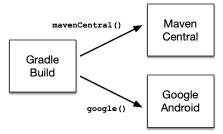

아래와 같이 선언하면 [Maven Central 저장소](https://repo.maven.apache.org/maven2/)를 사용할 수 있습니다.

```groovy
repositories {
    mavenCentral()
}
```

또한, 회사 네트워크 내에서만 액세스할 수 있는 [Nexus Repository](https://www.sonatype.com/products/repository-oss)와 같은 사내 Maven 저장소를 추가할 수 있습니다.

```groovy
repositories {
    maven {
        url "http://repo.mycompany.com/maven2"
    }
}
```

##### Dependencies

`dependencies` 블록을 사용하여 프로젝트에서 사용하는 라이브러리의 의존성을 선언합니다.  
Gradle에는 모듈, 파일, 프로젝트 등 다양한 의존성이 있으며, 가장 일반적인으로 모듈 의존성을 사용합니다. 모듈 의존성 선언은 문자열(String) 표기법과 Map 표기법을 사용하여 할 수 있습니다.

다음 구문(Syntax)을 사용하여 의존성을 선언합니다.

```groovy
dependencies {
    configurationName dependencyNotation
}
```

* 문자열(group:name:version) 표기법

    ```groovy
    dependencies {
        implementation('org.apache.commons:commons-lang3:3.3.2')
    }
    ```

    또는

    ```groovy
    dependencies {
        implementation 'org.apache.commons:commons-lang3:3.3.2'
    }
    ```

* Map 표기법

    ```groovy
    dependencies {
        compileOnly(group: 'javax.servlet', name: 'javax.servlet-api', version:'3.1.0')
    }
    ```

    또는

    ```groovy
    dependencies {
        compileOnly group: 'javax.servlet', name: 'javax.servlet-api', version:'3.1.0'
    }
    ```

Java 플러그인에는 아래와 같은 의존성 구성(Dependency configurations)이 있습니다.  
좀 더 상세한 내용은 [Java 플러그인의 의존성 관리](https://docs.gradle.org/current/userguide/java_plugin.html#sec:java_plugin_and_dependency_management) 섹션을 참고하십시오.

* `implementation` : 구현 전용 의존성.
* `api` : 컴파일 및 런타임 시에 대해 소비자에게 전이적으로 내보내는 의존성.
* `compileOnly` : 런타임에 사용되지 않는 컴파일 시 전용 의존성. Maven의 `provided` 범위(scope)와 유사하게 작동하는 컴파일 시 필요하지만 런타임 시에는 필요하지 않는 라이브러인 경우 사용 (빌드 결과물에는 포함하지 않음)
* `runtimeOnly` : 런타임 전용 의존성. 컴파일 시에는 필요 없고 런타임에만 필요한 의존성.
* `testImplementation` : 테스트에 대한 구현 전용 의존성.

> `api` 구성에 나타나는 의존성은 라이브러리의 컨슈머(consumer, 본 모듈을 의존하고 있는 모듈들)에게 전이적으로 노출되며, 컨슈머(consumer)의 컴파일 classpath에 나타납니다. 반면에 `implementation` 구성에서 나타나는 의존성은 컨슈머에게 노출되지 않으므로, 컨슈머의 컴파일 classpath로 노출되지 않습니다. 즉, "A(api) <- B <- C"로 의존 관계가 있는 경우 C에서 A를 접근할 수 있으나, "A(implementation) <- B <- C"의 경우 C에서 A를 접근할 수 없습니다.

##### Profiles 및 Properties

다음과 같이 구성하면 Maven의 Profiles과 마찬가지로 배포 환경에 따라 변경될 필요가 있는 속성(Properties)을 설정할 수 있습니다.

* `sr/main/resources/config.properties` 파일에 아래와 같이 속성들을 정의합니다.

    ```properties
    jdbc.url        = ${jdbc_url}
    jdbc.username   = ${jdbc_username}
    jdbc.password   = ${jdbc_password}
    ```

* 프로젝트 루트에 `profile-local.gradle`, `profile-dev.gradle`, 및 `profile-prod.gradle` 파일을 생성하고 각각의 환경에 맞게 `ext.jdbc_url`, `ext.jdbc_username`, `ext.jdbc_password` 프로퍼티를 정의합니다.

* `build.gradle` 파일에 아래 내용을 추가합니다.

    ```groovy
    ...
    if (!hasProperty('env')) ext.env = 'local'
    apply from: "profile-${env}.gradle"

    processResources {
        filesMatching('config.properties') {
            expand(project.properties)
        }
    }
    ...
    ```

* 환경 별 `gradle assemble` 명령을 `-Penv=[profile]` 옵션을 추가하여 실행 후 `build/resources/main/project.properties` 파일 내용을 확인합니다. (예: 개발 환경 - `gradle assemble -Penv=dev` 실행)

##### Tasks

일반적으로 Task은 플러그인을 적용하여 제공되므로 사용자가 직접 정의할 필요가 없으나, 아래와 같이 필요한 구성이 있으면 추가합니다. 예제는 JUnit 4.12를 사용하여 테스트하는 간단한 설정을 보여줍니다.

```groovy
dependencies {
    testImplementation('junit:junit:4.12')
}

test {
    useJUnit()
}
```

Java 플러그인은 Java 플러그인이 자동으로 적용하는 [Base 플러그인](https://docs.gradle.org/current/userguide/base_plugin.html#sec:base_tasks)에 의해 정의된 라이프사이클 태스크에 일부 자체 태스트을 첨부하고, 몇 가지 다른 라이프사이클 태스크도 추가합니다.  
Java 플러그인을 적용하면 다음과 같은 [Lifecycle Tasks](https://docs.gradle.org/current/userguide/java_plugin.html#lifecycle_tasks)을 실행할 수 있습니다.

* `assemble`
  * `jar` 태스트 및 `archives` 구성에 연결된 아티팩트를 생성하는 다른 모든 태스트에 의존.
  * 프로젝트 내의 모든 아키이브를 취합하는 집계(Aggregate) 태스크. (Base 플러그인에 의해 추가됨)
* `check`
  * `test` 태스트에 의존.
  * 테스트 실행과 같은 검증(Verification) 작업을 수행하는 집계 태스크. (Base 플러그인에 의해 추가됨)
* `build`
  * `check`, `assemble` 태스트에 의존.
  * 프로젝트의 전체 빌드를 수행하는 집계 태스크. (Base 플러그인에 의해 추가됨)
* `buildNeeded`
  * `build` 태스트 및 `testRuntimeClasspath` 구성에 의존성이 있는 모든 프로젝트의 `buildNeeded` 태스트에 의존.
  * 프로젝트 및 이 프로젝트가 의존하는 모든 프로젝트의 전체 빌드를 수행.
* `buildDependents`
  * `build` 태스트 및 해당 `testRuntimeClasspath` 구성에서 이 프로젝트를 의존성으로 포함하는 모든 프로젝트의 `buildDependents` 태스크에 의존.
  * 프로젝트 및 이 프로젝트에 의존하는 모든 프로젝트의 전체 빌드를 수행.
* `buildConfigName` — 태스크 규칙
  * `ConfigName`이라고 명명된 구성에 연결된 아티팩트를 생성하는 모든 태스크에 의존.
  * 지정된 구성에 대한 아티팩트를 취합(Assemble). (Base 플러그인에 의해 추가됨)
* `uploadConfigName` — 태스크 규칙, type: [Upload](https://docs.gradle.org/current/dsl/org.gradle.api.tasks.Upload.html)
  * `ConfigName`이라고 명명된 구성에 연결된 아티팩트를 생성하는 모든 태스크에 의존.
  * 지정된 구성에 대한 아티팩트를 취합하고 업로드. (Base 플러그인에 의해 추가됨)

다음 다이어그램은 이러한 태스크 간의 관계를 보여줍니다.


`tasks.register()`를 사용하여 새로운 Task를 추가할 수 있습니다.  
아래는 이미지를 제외한 CSS, Javascript 파일들을 Zip 파일로 압축하여 `build/dist` 경로에 생성하는 태스크입니다.

```groovy
tasks.register('zip', Zip) {
    from 'src/main/webapp/resources'
    archiveFileName = 'web-resources.zip'
    destinationDirectory = layout.buildDirectory.dir('dist')
    exclude '**/img/'
}
```

#### Settings 파일

Gradle에서는 빌드 스크립트 파일 외에 설정 파일인 `settings.gradle`을 정의해야 합니다.

단일 프로젝트 빌드의 설정입니다. 단일 프로젝트 빌드의 경우 설정 파일은 선택 사항입니다.([Gradle 프로젝트 구성](https://docs.gradle.org/current/userguide/organizing_gradle_projects.html#organizing_gradle_projects) 참조)

```groovy
rootProject.name = 'spring-mvc-with-gradle'
```

하나의 루트 프로젝트와 하나 이상의 하위 프로젝트로 구성된 다중 프로젝트(Multi-Project)는 아래와 같이 구성할 수 있습니다.

```groovy
rootProject.name = 'simple-multi-module'    // 전체 프로젝트의 이름을 설정
include 'simple-weather', 'simple-webapp'   // 이 빌드의 일부로 두 개의 하위 프로젝트 구성
```

* `rootProject.name` : 빌드에 이름을 할당합니다. 이는 빌드가 있는 디렉토리에 따라 빌드 이름을 지정하는 기본 동작을 재정의합니다. 프로젝트가 공유되는 경우 폴더가 변경될 수 있으므로 고정 이름을 설정하는 것이 좋습니다. (예: Git 저장소의 루트)
* `include` : 빌드가 실제 코드와 빌드 로직을 포함하는 하나 이상의 하위 프로젝트로 구성됨을 정의합니다.


## GitLab CI/CD 환경 변수 생성

`.gitlab-ci.yml` 파일에서 호출하여 사용할 CI/CD 환경 변수를 생성합니다.

* 프로젝트의 **Settings > CI/CD**로 이동하여 **Variables** 섹션을 확장합니다.
* **Add Variable** 버튼을 클릭한 다음, **Add Variable** 모달 창에서 세부사항 입력하고 **Add variable** 버튼을 클릭합니다.
  * Key : `DEV_SSH_PW` 입력
  * Value : 개발 SSH 서버의 패스워드 입력
  * Type : `Variable` 선택
  * Environment scope : `All` 선택
  * Protect variable (선택 사항) : 보호된 브랜치 또는 태그에서 실행되는 파이프라인에서만 변수를 사용하려면 체크
  * Mask variable (선택 사항) : 체크 (기본적으로 체크하지 않아도 되나, 패스워드와 같은 중요한 변수는 체크합니다.)

    > 체크하면 변수의 **Value**가 Job 로그에 마스킹됩니다. 값이 [마스킹 요구사항](https://docs.gitlab.com/ee/ci/variables/README.html#mask-a-cicd-variable)을 충족하지 않으면 변수가 저장되지 않습니다.

  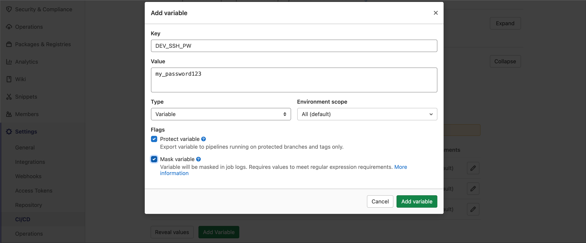

* SSH/SFTP를 통해 개발/운영 서버에 배포하는데 필요한 환경 변수들을 비슷한 방법으로 생성합니다.

  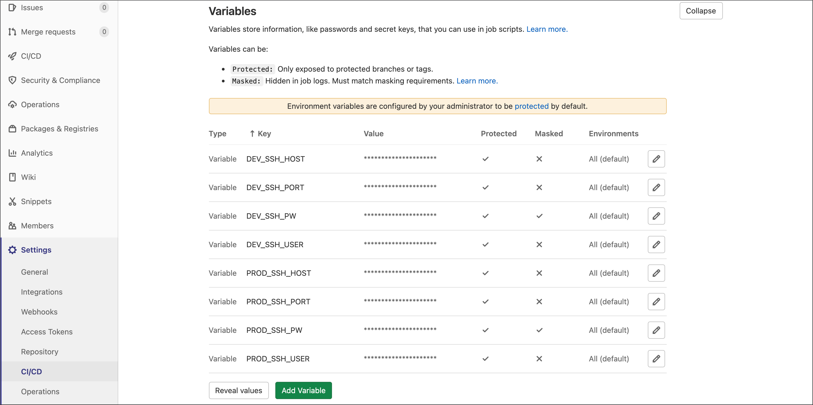

## `.gitlab-ci.yml` 구성

### `.gitlab-ci.yml` 파일의 주요 키워드

#### `variables`

CI/CD 변수는 Job에 전달되는 구성 가능한 값입니다. 커스텀 변수를 만드는 데 `variables` 키워드를 사용합니다.  
변수는 `script`, `before_script` 및 `after_script` 명령에서 항상 사용할 수 있습니다.

아래와 같은 변수는 Maven 명령을 실행할 때 성능을 향상시킬 수 있습니다.

```yaml
variables:
  MAVEN_OPTS: "-Dhttps.protocols=TLSv1.2 -Dmaven.repo.local=$CI_PROJECT_DIR/.m2/repository -Dorg.slf4j.simpleLogger.log.org.apache.maven.cli.transfer.Slf4jMavenTransferListener=WARN -Dorg.slf4j.simpleLogger.showDateTime=true -Djava.awt.headless=true"
  MAVEN_CLI_OPTS: "--batch-mode --errors --fail-at-end --show-version -DinstallAtEnd=true -DdeployAtEnd=true"
...
```

#### `cache`

`cache`를 사용하여 Job 사이에 캐시하기 위해 파일 및 디렉토리의 목록을 지정할 수 있습니다. 로컬 작업 복사본에 있는 경로만 사용할 수 있습니다.  
캐싱은 파이프라인과 Job 간에 공유됩니다.  
`cache:paths` 키워드를 사용하여 캐시할 파일 또는 디렉토리를 지정합니다.

아래와 같이 `cache`를 설정하면 Maven의 로컬 저장소인 `.m2/repository` 디렉토리를 캐싱하여, CI/CD 파이프라인을 두 번 이상 실행하면 이미 다운로드 받은 의존성 라이브러리를 다시 다운로드 받지 않아 성능이 향상됩니다.

```yaml
...
cache:
  paths:
    - .m2/repository
...
```

#### `stages`

`stages`은 Job 그룹을 포함하는 단계를 정의하는 데 사용합니다. Job에 `stage`를 사용하여 특정 단계에서 실행되도록 Job을 구성할 수 있습니다.  
`stages`에 있는 항목의 순서는 Job의 실행 순서를 정의합니다.

* 같은 단계의 Job들은 병렬로 실행됩니다.
* 다음 단계의 Job들은 이전 단계의 Job이 모두 성공적으로 완료된 후 실행됩니다.

```yaml
...
stages:
  - build
  - deploy
...
```

* `build` 단계의 모든 Job은 병렬로 실행됩니다.
* `build` 단계의 모든 작업이 성공하면 `deploy` Job들이 병렬로 실행됩니다.
* `deploy` 단계의 모든 작업이 성공하면 파이프라인이 `passed`로 표시됩니다.

#### Job 키워드

`build_webapp`, `dev_deploy` 및 `prod_deploy`은 Job 이름입니다.

Job은 다음과 같습니다.

* 실행되어야 하는 조건을 나타내는 제약 조건으로 정의됩니다.
* 임의의 이름을 가진 최상위 요소로 최소한 `script`절을 포함해야 합니다.
* 정의할 수 있는 수에는 제한이 없습니다.

Job 하위에 다음과 같은 키워드가 사용됩니다.

* `stage` 키워드는 앞서 설명한 대로 Job이 실행될 단계을 정의합니다.  
* `image` 키워드는 Job이 실행되는 Docker 이미지를 지정합니다. `maven:3.6.1-jdk-7`와 같이 Docker Registry가 포함되어 있지 않으면, [Docker Hub](https://hub.docker.com/)에서 Docker 이미지를 Pull 하고, `cody-dockerhost.autoever.com/cody/cody-tools:0.6`와 같이 지정되어 있으면 해당 Docker Registry에서 이미지를 Pull 합니다.  
  **JDK 버전 및 Java 빌드 도구(Ant, Maven, Gradle)에 따라 해당 Docker 이미지로 변경해야 합니다.**
  * Ant + JDK 5 : `cody-dockerhost.autoever.com/cody/ant:1.9.16-jdk-5`
  * Ant + JDK 6 : `cody-dockerhost.autoever.com/cody/ant:1.9.16-jdk-6`
  * Ant + JDK 7 : `cody-dockerhost.autoever.com/cody/ant:1.9.16-jdk-7`
  * Maven + JDK 7 : `maven:3.6.1-jdk-7`
  * Maven + JDK 8 : `maven:3.8.4-jdk-8`
  * Gradle + JDK 8 : `gradle:7.3.1-jdk8`
* `interruptible` 키워드는 Job이 완료되기 전에 새 파이프라인이 시작될 때 Job을 취소해야 하는 경우 사용합니다.
* `script` 키워드는 실행할 명령을 지정합니다. `mvn $MAVEN_CLI_OPTS clean package -Pweb -DskipTests` 스크립트는 Maven Docker 컨테이너 내에서 Maven 패키지 명령을 실행합니다. Ant 패키지 명령은 `ant -f build.xml package`와 같이 실행합니다.
* `artifacts` 키워드는 Job 아티팩트로 저장할 파일을 지정하는 데 사용 합니다. Job이 완료된 후 아티팩트가 GitLab으로 전송됩니다. GitLab UI에서 다운로드할 수 있습니다.
  * `artifacts:untracked`를 사용하여 추적되지 않은 모든 Git 파일을 아티팩트로 추가합니다.(리포지토리의 `.gitignore` 파일에 있는 구성을 무시합니다.)
  * `artifacts:paths`로 아티팩트로 저장할 디렉토리와 파일을 지정합니다.
  * `artifacts:expire_in`는 Job 아티팩트가 만료되어 삭제되기 전에 저장되는 기간을 지정하는 데 사용 합니다.
* `tags` 키워드는 프로젝트에 사용할 수 있는 모든 Runner 중에서 특정 러너를 선택하는 데 사용 합니다. 지정한 태그에 해당하는 Runner에서만 Job이 실행됩니다.

```yaml
...
build_webapp:
  stage: build
  image: maven:3.6.1-jdk-7
  interruptible: true
  script:
    - mvn $MAVEN_CLI_OPTS clean package -Pweb -DskipTests
  artifacts:
    untracked: true
    paths:
      - target/*.war
      - target/*.zip
    expire_in: 2 hrs
  tags:
    - docker
...
```

### `.gitlab-ci.yml` 파일 생성

* GitLab의 **Project overview** 페이지에서 `dev` 브랜치를 선택하고 **Web IDE** 버튼을 클릭합니다.
* New file 아이콘을 클릭합니다.
* **Create new file** 모달 창에서 `.gitlab-ci.yml`를 클릭합니다.
  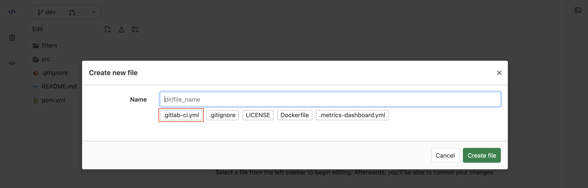
* 오른쪽 Edit 영역에 샘플 `.gitlab-ci.yml`을 참고하여 각 프로젝트에 맞게 내용을 수정하여 작성합니다.
  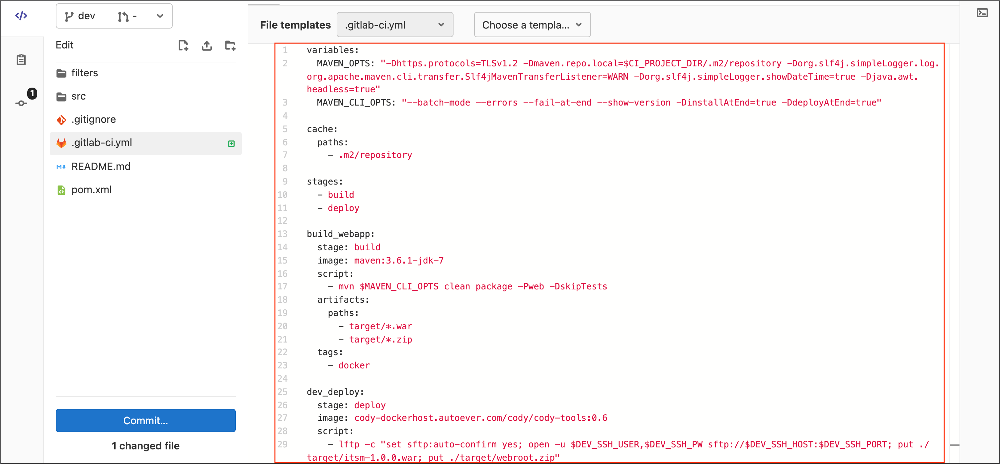
* **Commit...** 버튼을 클릭합니다.
* **Commit message** 필드에 커밋 메시지를 입력합니다. (예: `Update .gitlab-ci.yml`)
* `Commit to dev branch`을 선택합니다.
* `Start a new merge request`을 체크 해제합니다.
* **Commit** 버튼을 클릭합니다.

